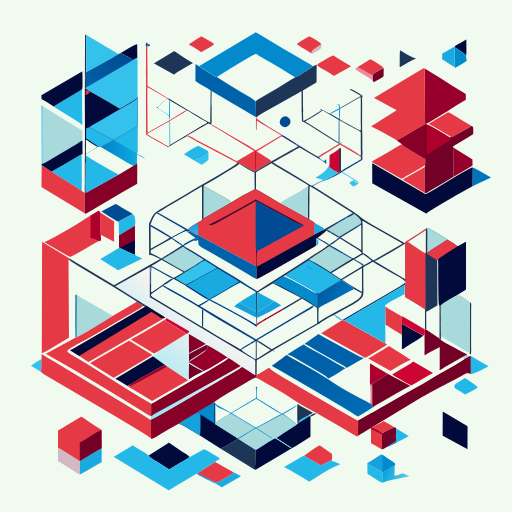
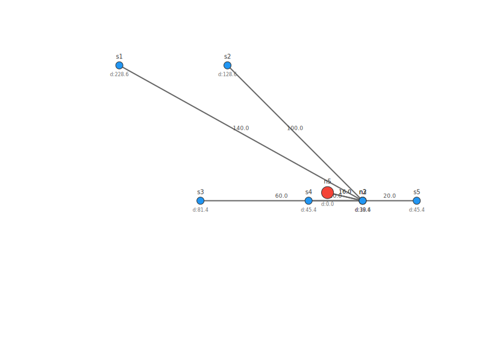
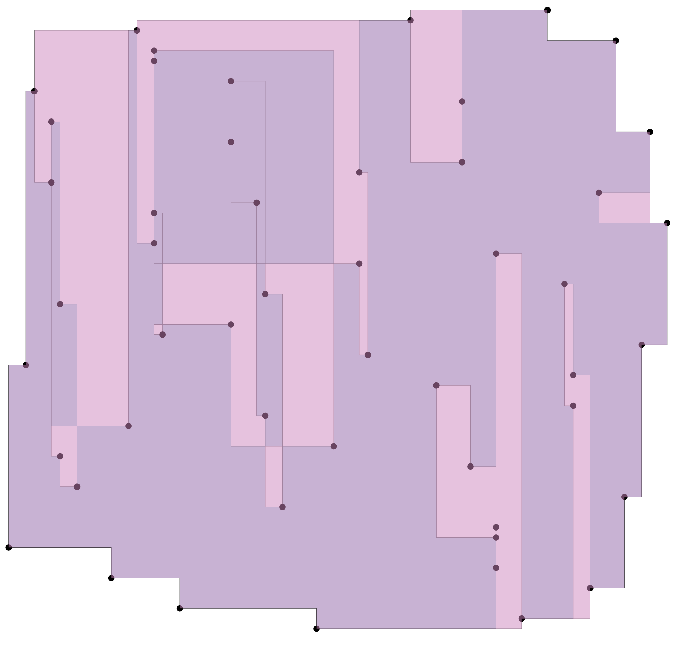
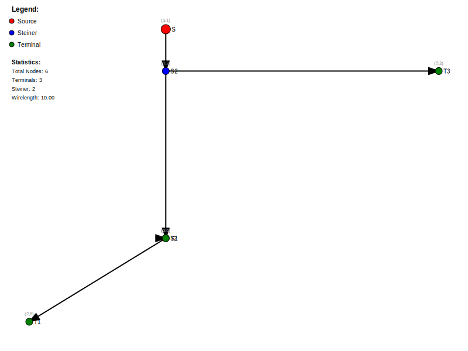
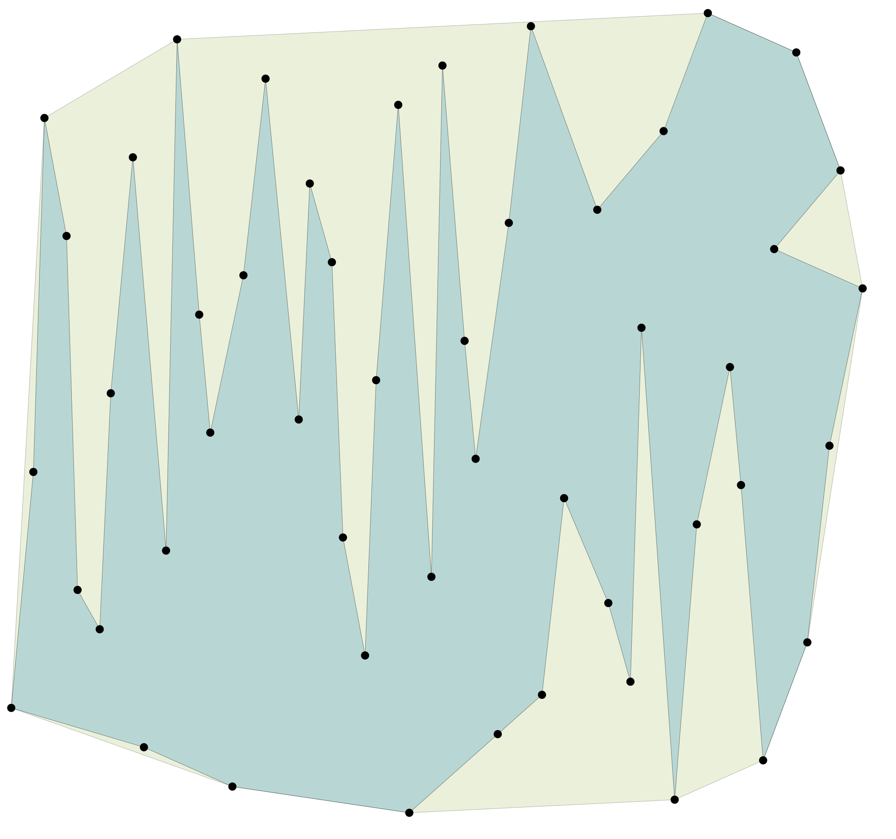

  

# 🧱 physdes-py

> Physical Design Python Code

## ✨ Features

- Rectilinear Polygon support

## 🚀 Recent Developments

- **3D Global Router:** A 3D global router has been added to the project.
- **Smarter Global Router:** The global router has been made smarter.
- **Bug Fixes:** Several bugs have been fixed, including those identified by mypy.
- **Documentation:** More documentation tests have been added.
- **Visualization:** Display colors as layers in the visualization.

## Dependencies

- [luk036/mywheel](https://github.com/luk036/mywheel)
- [luk036/lds-gen](https://github.com/luk036/lds-gen) (for testing only)

## 👀 See also

- [physdes-cpp](https://github.com/luk036/physdes-cpp)
- [physdes-rs](https://github.com/luk036/physdes-rs)

## 👉 Note

This project has been set up using PyScaffold 3.2.1. For details and usage
information on PyScaffold see <https://pyscaffold.org/>.

## Output Examples

### Basic Clock Tree

### Convex Hull

### Example Route Simple

### Polygon Convex Hull

