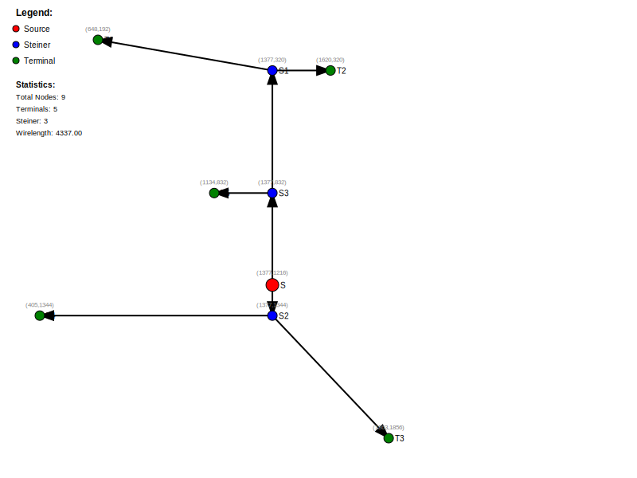
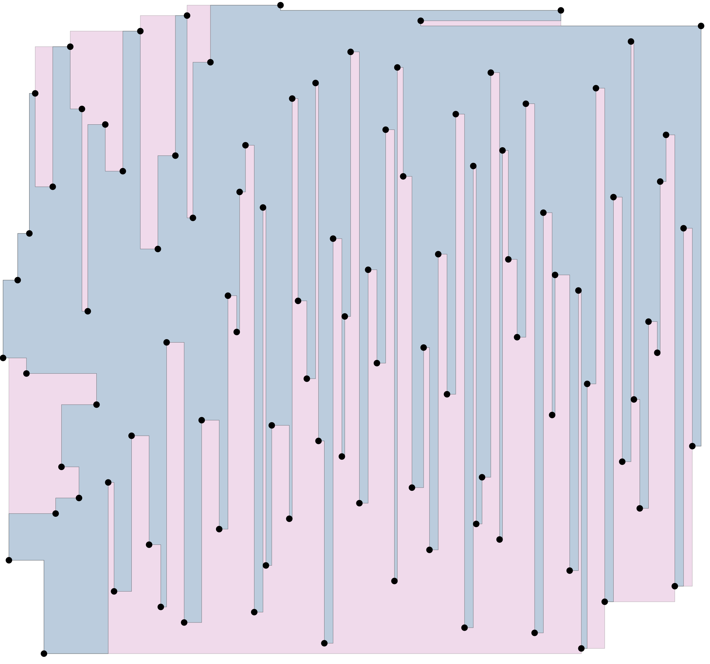
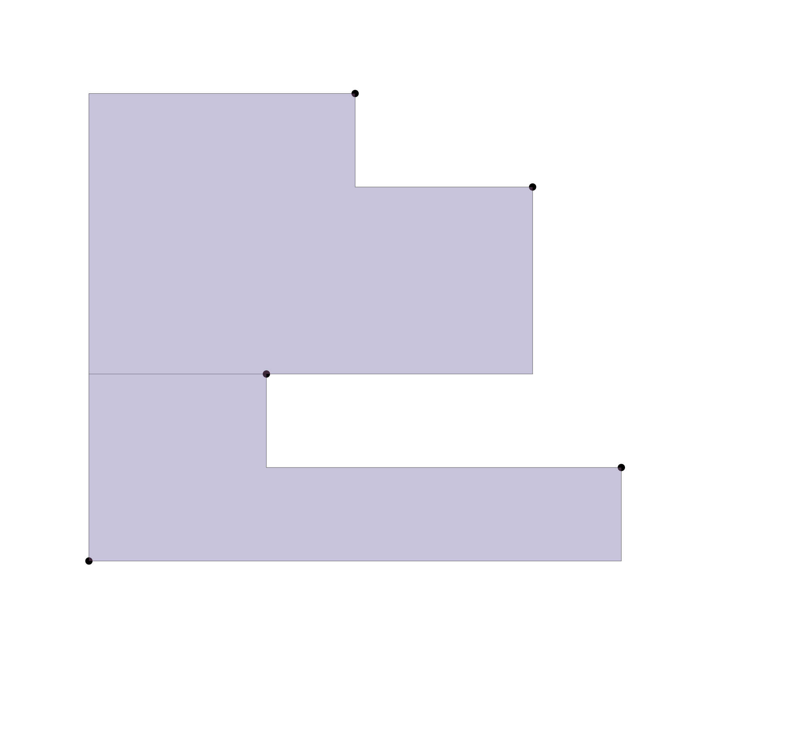
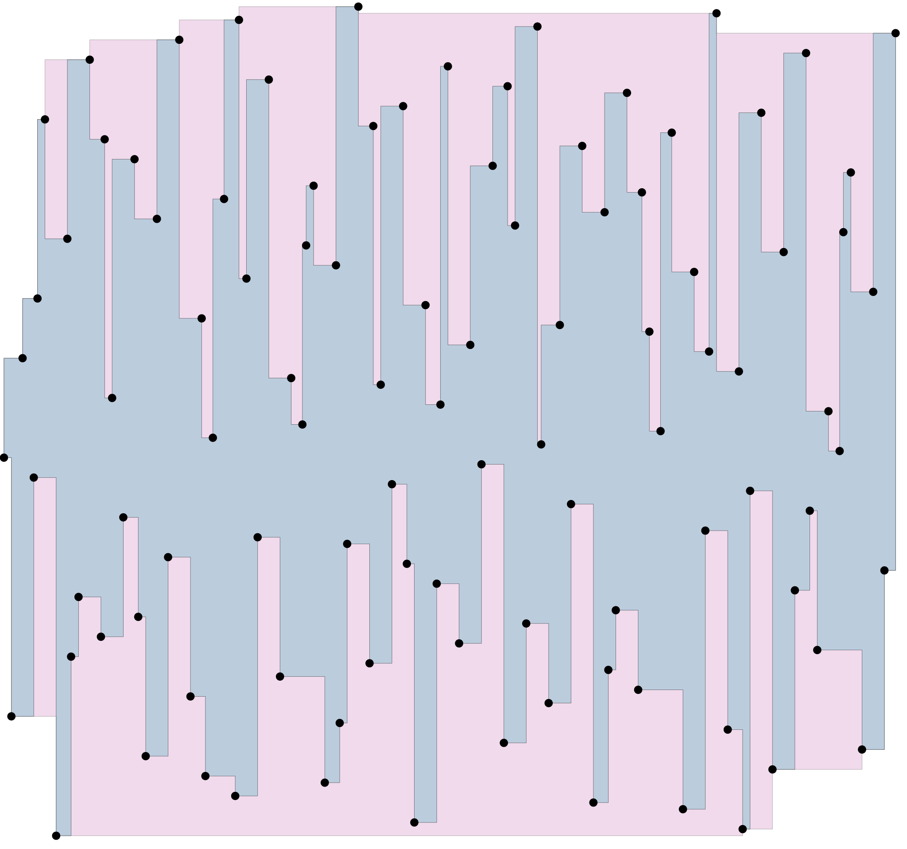
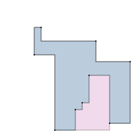

  

# 🧱 physdes-py

> Physical Design Python Code

## ✨ Features

- Rectilinear Polygon support

## 🚀 Recent Developments

- **Deferred Merge Embedding (DME) Algorithm:** Implemented the DME algorithm for clock tree synthesis, featuring a strategy pattern for delay calculation. This allows for flexible delay modeling, with both `LinearDelayCalculator` and `ElmoreDelayCalculator` provided as options. The algorithm is designed to build a zero-skew clock tree and includes functionalities for analyzing clock skew, total wirelength, and other tree statistics.
- **Global Router Enhancements:** The global router now offers multiple routing strategies to accommodate different design needs:
  - `route_simple()`: Connects terminals directly to the nearest node in the tree for quick and straightforward routing.
  - `route_with_steiners()`: Inserts Steiner points to optimize wire length, resulting in more efficient routing.
  - `route_with_constraints()`: A performance-driven approach that also uses Steiner points to reduce wire length.

## Dependencies

- [luk036/mywheel](https://github.com/luk036/mywheel)
- [luk036/lds-gen](https://github.com/luk036/lds-gen) (for testing only)

## 👀 See also

- [physdes-cpp](https://github.com/luk036/physdes-cpp)
- [physdes-rs](https://github.com/luk036/physdes-rs)

## 👉 Note

This project has been set up using PyScaffold 3.2.1. For details and usage
information on PyScaffold see <https://pyscaffold.org/>

## 🤖 For AI Agents

If you're an AI agent working on this repository, please see [AGENTS.md](AGENTS.md)
for comprehensive guidelines on:
- Build/lint/test commands
- Code style and conventions
- Testing practices
- Development workflow

## Output Examples

### Clock Tree Synthesis Examples

**Elmore Delay Model Clock Tree**

**Linear Delay Model Clock Tree**

**Delay Model Comparison**

**3D Elmore Model Clock Tree**

**3D Linear Model Clock Tree**

### Global Routing Examples

**Routing with Steiner Points**

**Routing with Constraints**

**Routing with Keepouts**

**Routing with Steiner Points and Keepouts**

**3D Routing with Steiner Points**

**3D Routing with Constraints and Keepouts**

### Rectilinear Polygon Examples

**Rectilinear Polygon Convex Hull**

**Rectilinear Polygon Convex Cut**

**X-Monotone Hull**

**Y-Monotone Hull**

### Steiner Forest

**Steiner Forest**

