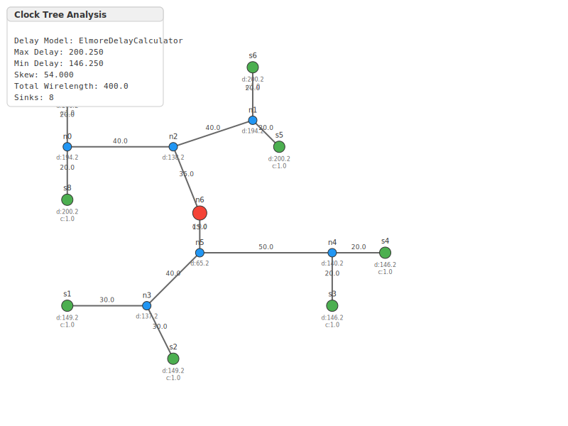
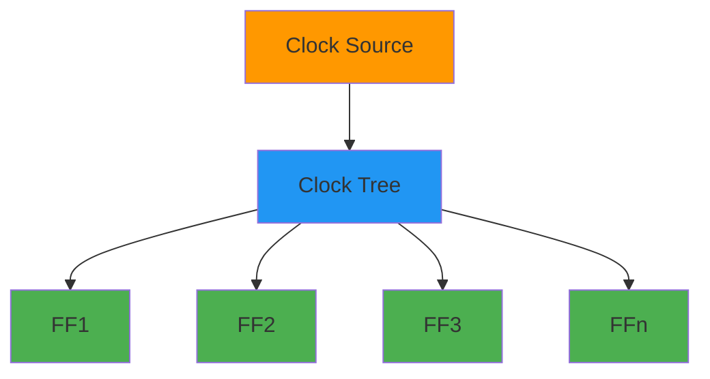
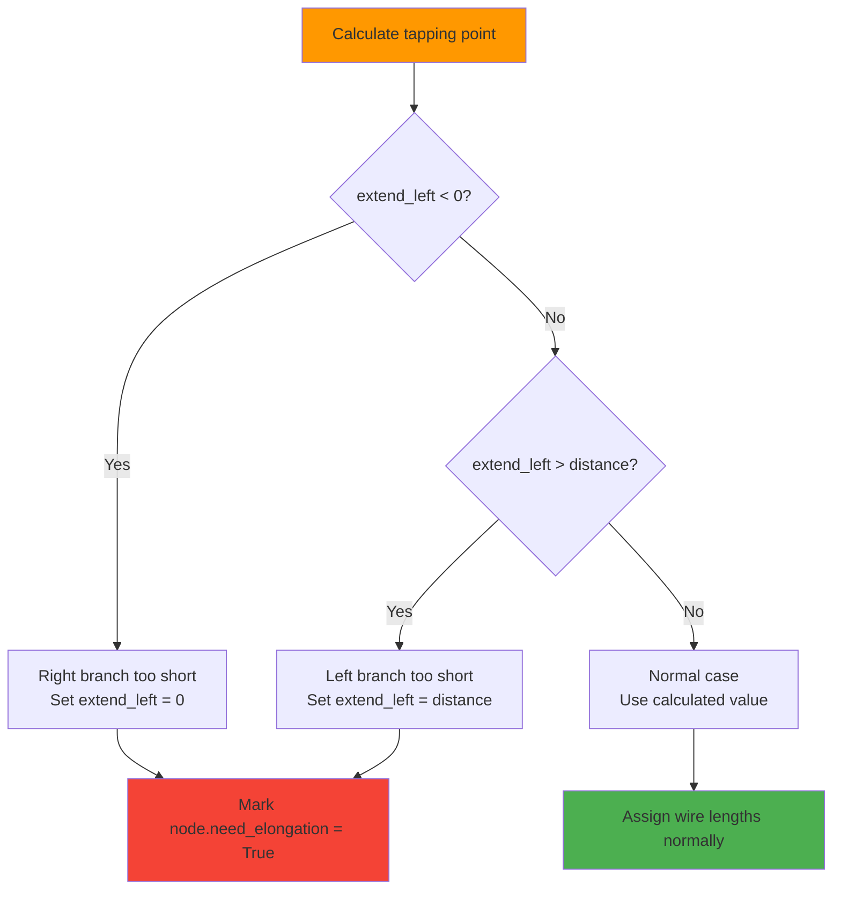
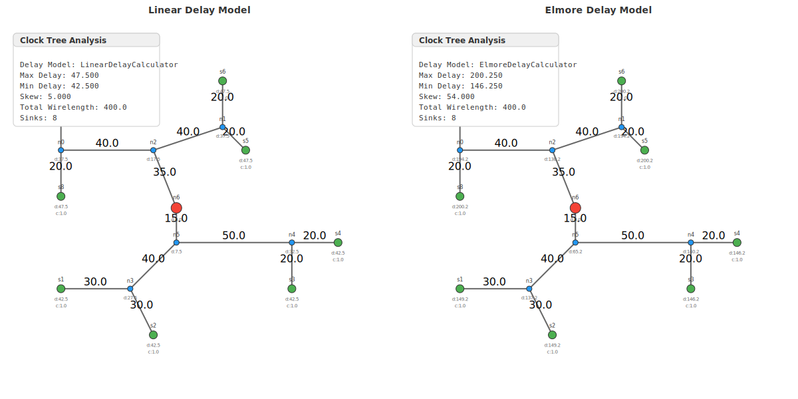
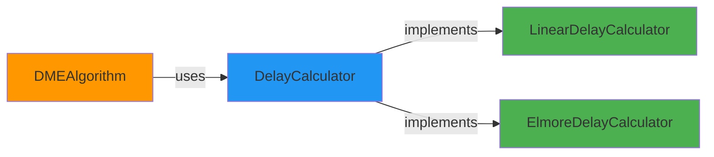
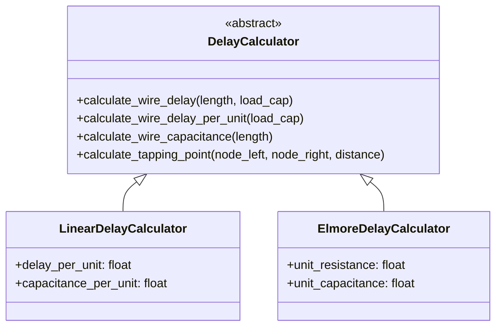

<!-- slide 1 -->
# ⏰ Deferred-Merge Embedding (DME) Algorithm in Clock Tree Synthesis

### prescribed-skew (not necessarily zero) Clock Tree Construction

<div align="center">



</div>

---

<!-- slide 2 -->
## 📋 Agenda

1. **Introduction** - What is Clock Tree Synthesis? 🎯
2. **DME Algorithm Overview** - Core Concepts 🧠
3. **Data Structures** - Sink, TreeNode, Delay Calculators 📦
4. **Strategy Pattern** - Pluggable Delay Models ⚙️
5. **Algorithm Steps** - Build, Merge, Embed 🔄
6. **Linear vs Elmore** - Delay Model Comparison 📊
7. **Elongation Handling** - Boundary Conditions 🔧
8. **Visualization** - SVG Output Examples 🖼️
9. **Code Demo** - Implementation 💻
10. **Summary & Future Work** 🔮

---

<!-- slide 3 -->
## 🎯 What is Clock Tree Synthesis (CTS)?

> **Clock Tree Synthesis** creates a distribution network that delivers the clock signal to all sequential elements (flip-flops, registers) with **minimum skew**.



### Key Objectives:
- ✅ **prescribed-skew (not necessarily zero)**: All sinks receive clock at the prescribed time
- ✅ **Minimum wirelength**: Reduce area and power
- ✅ **Balanced tree**: Equal path delays to all endpoints

---

<!-- slide 4 -->
## 🧠 DME Algorithm - Core Concept

### Deferred Merge Embedding

The DME algorithm consists of **two phases**:

```mermaid
flowchart LR
    A[Phase 1:<br/>Bottom-Up] --> B[Phase 2:<br/>Top-Down]
    B --> C[prescribed-skew (not necessarily zero)<br/>Clock Tree]

    style A fill:#ff9800
    style B fill:#2196f3
    style C fill:#4caf50
```

### Phase 1: Bottom-Up (Merge)
- Compute **merging segments** for each node
- Segment = set of possible locations for prescribed-skew (not necessarily zero)

### Phase 2: Top-Down (Embed)
- Select actual positions from merging segments
- Minimize total wirelength

---

<!-- slide 5 -->
## 🔀 Merging Segment Concept

```
.. svgbob::
   :align: center

          . v
         .
        .
       .
      . L ______ R
     .          .
    .           .
   ._____________

```

### Key Elements:
- **L, R**: Left and right subtrees (children)
- **Boxes**: Merging segments (MS) of children
- **v**: New parent node to be created
- **Dashed lines**: Projection to form new MS

### Definition:
> **Merging Segment**: The set of all possible positions where a parent node can be placed while maintaining **prescribed-skew (not necessarily zero)** between its children.

---

<!-- slide 6 -->
## 📦 Data Structures

### 1. Sink - Clock Endpoint

```python
@dataclass
class Sink:
    name: str
    position: Point
    capacitance: float = 1.0
```

### 2. TreeNode - Tree Element

```python
@dataclass
class TreeNode:
    name: str
    position: Point
    left: Optional[TreeNode] = None
    right: Optional[TreeNode] = None
    parent: Optional[TreeNode] = None
    wire_length: int = 0
    delay: float = 0.0
    capacitance: float = 0.0
    need_elongation = False
```

### Node Types:
| Type | Description |
|------|-------------|
| Leaf | Clock sink (flip-flop) |
| Internal | Merging point |
| Root | Clock source connection |

---

<!-- slide 7 -->
## ⚙️ Strategy Pattern - Delay Calculators

### Abstract Base Class

```python
class DelayCalculator(ABC):
    @abstractmethod
    def calculate_wire_delay(self, length: int, load_capacitance: float) -> float:
        pass

    @abstractmethod
    def calculate_wire_delay_per_unit(self, load_capacitance: float) -> float:
        pass

    @abstractmethod
    def calculate_wire_capacitance(self, length: int) -> float:
        pass

    @abstractmethod
    def calculate_tapping_point(self, node_left, node_right, distance) -> Tuple[int, float]:
        pass
```

### Why Strategy Pattern?
- ✅ Swap delay models without changing algorithm
- ✅ Easy to add new models (e.g., higher-order RC)
- ✅ Clean separation of concerns

---

<!-- slide 8 -->
## 📊 Linear Delay Model

### Formula

$$delay = k \times length$$

Where $k$ is the delay per unit length.

### Implementation

```python
class LinearDelayCalculator(DelayCalculator):
    def __init__(self, delay_per_unit: float = 1.0,
                 capacitance_per_unit: float = 1.0):
        self.delay_per_unit = delay_per_unit
        self.capacitance_per_unit = capacitance_per_unit

    def calculate_wire_delay(self, length: int, load_capacitance: float) -> float:
        return self.delay_per_unit * length
```

### Tapping Point Calculation

```python
def calculate_tapping_point(self, node_left, node_right, distance):
    skew = node_right.delay - node_left.delay
    extend_left = round((skew / self.delay_per_unit + distance) / 2)
    delay_left = node_left.delay + extend_left * self.delay_per_unit
    return extend_left, delay_left
```

---

<!-- slide 9 -->
## 🔬 Elmore Delay Model

### Formula

$$delay = R \times \left( \frac{C_{wire}}{2} + C_{load} \right)$$

Where:
- $R$ = wire resistance
- $C_{wire}$ = wire capacitance
- $C_{load}$ = load capacitance

### Implementation

```python
class ElmoreDelayCalculator(DelayCalculator):
    def __init__(self, unit_resistance: float = 1.0,
                 unit_capacitance: float = 1.0):
        self.unit_resistance = unit_resistance
        self.unit_capacitance = unit_capacitance

    def calculate_wire_delay(self, length: int, load_capacitance: float) -> float:
        wire_resistance = self.unit_resistance * length
        wire_capacitance = self.unit_capacitance * length
        return wire_resistance * (wire_capacitance / 2 + load_capacitance)
```

### Key Difference:
| Model | Complexity | Accuracy |
|-------|------------|----------|
| Linear | O(1) | Basic |
| Elmore | O(1) | Realistic RC |

---

<!-- slide 10 -->
## 🔄 Algorithm Steps

### DMEAlgorithm.build_clock_tree()

```python
def build_clock_tree(self) -> TreeNode:
    # Step 1: Create leaf nodes from sinks
    nodes = [TreeNode(name=s.name, position=s.position,
                      capacitance=s.capacitance) for s in self.sinks]

    # Step 2: Build merging tree (balanced bipartition)
    merging_tree = self._build_merging_tree(nodes, False)

    # Step 3: Compute merging segments (bottom-up)
    merging_segments = self._compute_merging_segments(merging_tree)

    # Step 4: Embed tree (top-down)
    clock_tree = self._embed_tree(merging_tree, merging_segments)

    # Step 5: Compute delays and wire lengths
    self._compute_tree_parameters(clock_tree)

    return clock_tree
```

---

<!-- slide 11 -->
## 🌳 Step 2: Build Merging Tree

### Balanced Bipartition

```python
def _build_merging_tree(self, nodes: List[TreeNode], vertical: bool) -> TreeNode:
    if len(nodes) == 1:
        return nodes[0]

    # Sort along alternating axes (x, y, x, y...)
    if vertical:
        sorted_nodes = sorted(nodes, key=lambda n: n.position.xcoord)
    else:
        sorted_nodes = sorted(nodes, key=lambda n: n.position.ycoord)

    # Split into two balanced groups
    mid = len(sorted_nodes) // 2
    left_group = sorted_nodes[:mid]
    right_group = sorted_nodes[mid:]

    # Recursively build subtrees
    left_child = self._build_merging_tree(left_group, not vertical)
    right_child = self._build_merging_tree(right_group, not vertical)

    # Create parent node
    parent = TreeNode(name=f"n{self.node_id}",
                      position=left_child.position,
                      left=left_child, right=right_child)
    return parent
```

---

<!-- slide 12 -->
## 📐 Step 3: Compute Merging Segments

### Bottom-Up Algorithm

```python
def _compute_merging_segments(self, root: TreeNode) -> Dict[str, Any]:
    merging_segments = {}

    def compute_segment(node: TreeNode):
        if node.left is None and node.right is None:
            # Leaf: merging segment = point
            manhattan_segment = self.MA_TYPE.from_point(node.position)
            merging_segments[node.name] = manhattan_segment
            return manhattan_segment

        # Recursively compute children segments
        left_ms = compute_segment(node.left)
        right_ms = compute_segment(node.right)

        # Calculate distance between segments
        distance = left_ms.min_dist_with(right_ms)

        # Calculate tapping point for prescribed-skew (not necessarily zero)
        extend_left, delay_left = self.delay_calculator.calculate_tapping_point(
            node.left, node.right, distance)
        node.delay = delay_left

        # Merge segments
        merged_segment = left_ms.merge_with(right_ms, extend_left)
        merging_segments[node.name] = merged_segment

        # Update capacitance
        wire_cap = self.delay_calculator.calculate_wire_capacitance(distance)
        node.capacitance = node.left.capacitance + node.right.capacitance + wire_cap

        return merged_segment

    compute_segment(root)
    return merging_segments
```

---

<!-- slide 13 -->
## 🎯 Step 4: Top-Down Embedding

### Position Selection

```python
def _embed_tree(self, merging_tree, merging_segments):
    def embed_node(node, parent_segment=None):
        if node is None:
            return

        if parent_segment is None:
            # Root: choose position nearest to source
            node_segment = merging_segments[node.name]
            if self.source is None:
                node.position = node_segment.get_upper_corner()
            else:
                node.position = node_segment.nearest_point_to(self.source)
        else:
            # Internal: choose position nearest to parent
            node_segment = merging_segments[node.name]
            node.position = node_segment.nearest_point_to(node.parent.position)
            node.wire_length = node.position.min_dist_with(node.parent.position)

        # Recursively embed children
        embed_node(node.left, merging_segments[node.name])
        embed_node(node.right, merging_segments[node.name])

    embed_node(merging_tree)
    return merging_tree
```

---

<!-- slide 14 -->
## 🧮 Step 5: Compute Delays

### Final Delay Calculation

```python
def _compute_tree_parameters(self, root: TreeNode) -> None:
    def compute_delays(node, parent_delay=0.0):
        if node is None:
            return

        if node.parent:
            # Calculate wire delay from parent
            wire_delay = self.delay_calculator.calculate_wire_delay(
                node.wire_length, node.capacitance)
            node.delay = parent_delay + wire_delay
        else:
            node.delay = 0.0  # Root has zero delay

        # Recursively compute for children
        compute_delays(node.left, node.delay)
        compute_delays(node.right, node.delay)

    compute_delays(root)
```

---

<!-- slide 15 -->
## 📊 Linear vs Elmore - Comparison

### Example Output

```python
sinks = [
    Sink("s1", Point(10, 20), 1.0),
    Sink("s2", Point(30, 40), 1.0),
    Sink("s3", Point(50, 10), 1.0),
    Sink("s4", Point(70, 30), 1.0),
    Sink("s5", Point(90, 50), 1.0),
]
```

### Results Comparison

| Metric | Linear | Elmore |
|--------|--------|--------|
| Skew | 0.0 | 0.0 |
| Max Delay | ~45.0 | ~120.0 |
| Wirelength | Same | Same |

### Key Insight:
- Both achieve **prescribed-skew (not necessarily zero)** ✅
- Elmore provides **realistic delay** values
- Linear is faster for quick estimation

---

<!-- slide 16 -->
## 📈 Delay Model Formulas

### Linear Delay

$$D_{linear} = k \cdot L$$

### Elmore Delay

$$D_{Elmore} = R \cdot L \cdot \left(\frac{C \cdot L}{2} + C_{load}\right)$$

Or expanded:

$$D_{Elmore} = R \cdot C \cdot \frac{L^2}{2} + R \cdot C_{load} \cdot L$$

### Complexity:
- Linear: **O(L)** - proportional to length
- Elmore: **O(L²)** - quadratic (dominates for long wires)

---

<!-- slide 17 -->
## 🔧 Handling Elongation

### What is Elongation?

When the tapping point calculation yields a position **outside** the valid range, we need to **elongate** one branch to maintain prescribed-skew (not necessarily zero).



### Boundary Conditions

```python
def _handle_boundary_conditions(
    self,
    extend_left: int,
    distance: int,
    node_left: TreeNode,
    node_right: TreeNode,
    delay_left: float,
) -> Tuple[int, float]:
    if extend_left < 0:
        # Left branch cannot reach - extend right
        node_left.wire_length = 0
        node_right.wire_length = distance
        extend_left = 0
        delay_left = node_left.delay
        node_right.need_elongation = True  # ⚠️ Flag for later处理

    elif extend_left > distance:
        # Right branch cannot reach - extend left
        node_right.wire_length = 0
        node_left.wire_length = distance
        extend_left = distance
        delay_left = node_right.delay
        node_left.need_elongation = True  # ⚠️ Flag for later处理

    else:
        # Normal case
        node_left.wire_length = extend_left
        node_right.wire_length = distance - extend_left

    return extend_left, delay_left
```

### Why Elongation Happens?

| Scenario | Cause | Solution |
|----------|-------|----------|
| `extend_left < 0` | Left delay >> Right delay | Extend right wire to balance |
| `extend_left > distance` | Right delay >> Left delay | Extend left wire to balance |

### Visual Example

```
.. svgbob::
   :align: center

   Before Elongation:      After Elongation:

   L ---- v ---- R        L ---- v ---- R
   |                     |
   +----Elongation----+  +----Elongation----+

   The dotted line shows the extra wire added to balance delays.
```

### The `need_elongation` Flag

- Set to `True` when boundary condition triggers
- Used for **post-processing** or **reporting**
- Helps identify problematic branches in the tree

```python
# After tree building, check for elongation
def check_elongation(node):
    if node.need_elongation:
        print(f"Warning: {node.name} requires elongation")
    if node.left:
        check_elongation(node.left)
    if node.right:
        check_elongation(node.right)
```

---

<!-- slide 18 -->
## 🖼️ Visualization - 2D Clock Trees

### 1. Elmore Delay Model


---

### 2. Linear Delay Model


---

<!-- slide 19 -->
## 📊 Delay Model Comparison



*Shows Elmore vs Linear delay distribution across the tree*

---

<!-- slide 21 -->
## 💻 Code Demo - Basic Usage

### Create Clock Sinks

```python
from physdes.cts.dme_algorithm import Sink, DMEAlgorithm
from physdes.point import Point

# Define sinks (flip-flops)
sinks = [
    Sink("FF1", Point(0, 0), 1.0),
    Sink("FF2", Point(10, 0), 1.0),
    Sink("FF3", Point(5, 10), 1.0),
]
```

### Build Clock Tree

```python
# Using Linear delay model
linear_calc = LinearDelayCalculator(delay_per_unit=0.5)
dme_linear = DMEAlgorithm(sinks, delay_calculator=linear_calc)
clock_tree = dme_linear.build_clock_tree()

# Analyze results
analysis = dme_linear.analyze_skew(clock_tree)
print(f"Skew: {analysis['skew']}")  # Should be ~0
print(f"Wirelength: {analysis['total_wirelength']}")
```

---

<!-- slide 22 -->
### With Elmore Model

```python
# Using Elmore delay model
elmore_calc = ElmoreDelayCalculator(
    unit_resistance=0.1,
    unit_capacitance=0.2
)
dme_elmore = DMEAlgorithm(sinks, delay_calculator=elmore_calc)
clock_tree = dme_elmore.build_clock_tree()

# Analyze results
analysis = dme_elmore.analyze_skew(clock_tree)
print(f"Skew: {analysis['skew']}")  # Should be ~0
print(f"Max delay: {analysis['max_delay']:.3f}")
```

---

<!-- slide 23 -->
### With Source Location

```python
# Specify clock source location
source = Point(5, 5)
dme = DMEAlgorithm(
    sinks,
    delay_calculator=LinearDelayCalculator(),
    source=source
)
clock_tree = dme.build_clock_tree()

# Root will be placed nearest to source
print(f"Root position: {clock_tree.position}")
```

---

<!-- slide 24 -->
## 📈 Algorithm Complexity

| Operation | Time Complexity |
|-----------|----------------|
| Build merging tree | $O(n \log n)$ |
| Compute segments | $O(n)$ |
| Embed tree | $O(n)$ |
| Compute delays | $O(n)$ |
| **Total** | **$O(n \log n)$** |

Where $n$ = number of sinks

### Space Complexity: $O(n)$ for merging segments storage

---

<!-- slide 25 -->
## 🔍 prescribed-skew (not necessarily zero) Verification

### analyze_skew() Method

```python
def analyze_skew(self, root: TreeNode) -> Dict[str, Any]:
    sink_delays = []

    # Collect all sink delays
    def collect_sink_delays(node):
        if node is None:
            return
        if node.left is None and node.right is None:
            sink_delays.append(node.delay)
        collect_sink_delays(node.left)
        collect_sink_delays(node.right)

    collect_sink_delays(root)

    max_delay = max(sink_delays)
    min_delay = min(sink_delays)
    skew = max_delay - min_delay

    return {
        "max_delay": max_delay,
        "min_delay": min_delay,
        "skew": skew,
        "sink_delays": sink_delays,
        "total_wirelength": self._total_wirelength(root),
    }
```

---

<!-- slide 26 -->
## 🎯 Key Design Patterns

### 1. Strategy Pattern



### 2. Template Method

- `build_clock_tree()` defines the skeleton
- Subclasses customize delay calculation

---

<!-- slide 27 -->
## ⚠️ Boundary Conditions

### Handling Edge Cases

The algorithm handles special cases in `_handle_boundary_conditions()`:

```python
if extend_left < 0:
    # Left branch too short - extend right
    node_left.wire_length = 0
    node_right.wire_length = distance
    node_right.need_elongation = True

elif extend_left > distance:
    # Right branch too short - extend left
    node_right.wire_length = 0
    node_left.wire_length = distance
    node_left.need_elongation = True
else:
    # Normal case
    node_left.wire_length = extend_left
    node_right.wire_length = distance - extend_left
```

---

<!-- slide 28 -->
## 🧪 Testing

### Run Tests

```bash
# All tests
pytest tests/test_dme_algorithm.py -v

# Specific test
pytest tests/test_dme_algorithm.py::test_zero_skew -v

# With coverage
pytest --cov physdes.cts.dme_algorithm --cov-report term-missing
```

### Test Coverage:

| Feature | Tests |
|---------|-------|
| Zero skew verification | ✅ |
| Linear vs Elmore | ✅ |
| Boundary conditions (Elongation) | ✅ |
| Wirelength calculation | ✅ |

---

<!-- slide 29 -->
## 🔄 Related Modules

### ManhattanArc

Used for merging segment representation:

```python
class ManhattanArc:
    """Rectilinear path representation"""

    @staticmethod
    def from_point(point: Point) -> ManhattanArc:
        """Create arc from a single point"""

    def min_dist_with(self, other: ManhattanArc) -> int:
        """Calculate Manhattan distance between arcs"""

    def merge_with(self, other: ManhattanArc, extend_left: int) -> ManhattanArc:
        """Merge two arcs to form parent segment"""

    def nearest_point_to(self, point: Point) -> Point:
        """Find closest point on arc to given point"""
```

---

<!-- slide 30 -->
## 📚 File Structure

```
physdes-py/
├── src/physdes/
│   ├── cts/
│   │   └── dme_algorithm.py      # Main DME implementation ⭐
│   ├── manhattan_arc.py          # Merging segments
│   ├── point.py                  # Point/Interval classes
│   └── router/
│       └── global_router.py      # Related routing algorithms
├── tests/
│   └── test_dme_algorithm.py     # DME tests
├── outputs/
│   ├── *clock_tree*.svg          # Visualization outputs
│   └── delay_model_comparison.svg
└── README.md
```

---

<!-- slide 31 -->
## 🔮 Future Enhancements

### Potential Improvements

| Feature | Description | Difficulty |
|---------|-------------|------------|
| **Buffer insertion** | Add repeaters for long wires | ⭐⭐⭐ |
| **Useful skew** | Allow small skew for optimization | ⭐⭐ |
| **Power-aware** | Minimize power consumption | ⭐⭐⭐ |
| **Variation-aware** | Handle process variations | ⭐⭐⭐ |
| **Multi-clock** | Support multiple clock domains | ⭐⭐⭐ |

### Related Projects:
- [physdes-cpp](https://github.com/luk036/physdes-cpp) - C++ implementation
- [physdes-rs](https://github.com/luk036/physdes-rs) - Rust implementation

---

<!-- slide 32 -->
## ✅ Summary

### What We Covered:

1. **Clock Tree Synthesis** - prescribed-skew (not necessarily zero) objective
2. **DME Algorithm** - Bottom-up merge, top-down embed
3. **Data Structures** - Sink, TreeNode, ManhattanArc
4. **Strategy Pattern** - Linear and Elmore delay models
5. **Algorithm Steps** - Build, Merge, Embed, Compute
6. **Elongation Handling** - Boundary conditions for prescribed-skew (not necessarily zero)
7. **Visualization** - SVG output examples
8. **Code Demo** - Implementation walkthrough

### Key Takeaways:

- ✅ DME achieves **prescribed-skew (not necessarily zero)** reliably
- ✅ **Strategy pattern** enables flexible delay models
- ✅ Both Linear and Elmore produce valid trees
- ✅ Elongation handling ensures robust boundary condition treatment

---

<!-- slide 33 -->
## 🏁 Q&A

<div align="center">

### Questions?

{width=300px}

</div>

### Contact
- GitHub: [luk036/physdes-py](https://github.com/luk036/physdes-py)
- Documentation: [physdes-py.readthedocs.io](https://physdes-py.readthedocs.io/)

---

<!-- slide 34 -->
## 📎 Appendix: Mathematical Formulas

### Manhattan Distance (2D)

$$d((x_1, y_1), (x_2, y_2)) = |x_1 - x_2| + |y_1 - y_2|$$

### Wire Capacitance

$$C_{wire} = C_{unit} \times L$$

### Total Node Capacitance

$$C_{total} = C_{left} + C_{right} + C_{wire}$$

---

<!-- slide 35 -->
## 📎 Appendix: Class Hierarchy



---

<!-- slide 36 -->
## 📎 Appendix: API Reference

### DMEAlgorithm

| Method | Description |
|--------|-------------|
| `build_clock_tree()` | Main entry point |
| `analyze_skew(root)` | Return skew analysis |
| `_build_merging_tree()` | Create binary tree |
| `_compute_merging_segments()` | Bottom-up MS computation |
| `_embed_tree()` | Top-down positioning |
| `_compute_tree_parameters()` | Delay calculation |

### DelayCalculator

| Method | Description |
|--------|-------------|
| `calculate_wire_delay()` | Wire delay for segment |
| `calculate_wire_delay_per_unit()` | Delay per unit length |
| `calculate_wire_capacitance()` | Wire capacitance |
| `calculate_tapping_point()` | prescribed-skew (not necessarily zero) balance point |

---

<!-- slide 37 -->
## 🎬 End of Presentation

<div align="center">

### Thank you! 🎉

**physdes-py** - VLSI Physical Design Python Library


</div>
