<!-- slide 1 -->
# 🧭 Global Router with Keepouts and 3D Extension

### VLSI Physical Design Automation

<div align="center">


</div>

---

<!-- slide 2 -->
## 📋 Agenda

1. **Introduction** - What is Global Routing? 🎯
2. **Core Architecture** - GlobalRouter & RoutingTree 🏗️
3. **Routing Strategies** - Simple, Steiner, Constraints ⚡
4. **Keepouts** - Avoiding Obstacles 🚧
5. **3D Extension** - Multi-layer Routing 📦
6. **Visualization** - SVG Output Examples 🖼️
7. **Code Demo** - Live Examples 💻
8. **Summary & Future Work** 🔮

---

<!-- slide 3 -->
## 🎯 What is Global Routing?

> **Global routing** determines the general path of each net through the chip, while **detailed routing** refines the exact wire positions.

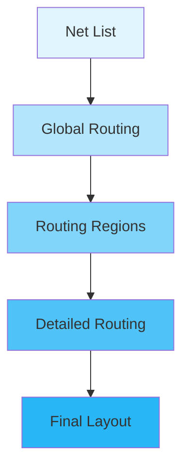

### Key Objectives:
- ✅ Minimize total wirelength
- ✅ Satisfy timing constraints
- ✅ Avoid routing obstacles (keepouts)
- ✅ Enable multi-layer (3D) routing

---

<!-- slide 4 -->
## 🏗️ Core Architecture

### GlobalRouter Class

```
┌─────────────────────────────────────────────┐
│              GlobalRouter                    │
├─────────────────────────────────────────────┤
│  - source_position: Point      (start)       │
│  - terminal_positions: List[Point] (sinks)  │
│  - keepouts: List[Point] (obstacles)        │
│  - tree: GlobalRoutingTree (result)         │
│  - worst_wirelength: int (constraint)       │
└─────────────────────────────────────────────┘
```

### Key Methods:
| Method | Purpose |
|--------|---------|
| `route_simple()` | Direct connection |
| `route_with_steiners()` | Optimal wirelength |
| `route_with_constraints()` | Performance-driven |

---

<!-- slide 5 -->
## 🌳 Routing Tree Structure

```python
class GlobalRoutingTree:
    """
    Global routing tree that supports
    Steiner node and terminal node insertion.
    """

    # Node Types:
    # - SOURCE: Starting point
    # - STEINER: Intermediate optimization points
    # - TERMINAL: End points (sinks)
```

### Tree Visualization:

```
                    +--.----------o (terminal)
                    |   `.
                    |     `.      (steiner)
                    |       `.
                    o---------`---+ (source)

         +--<---o
         |
         *-------->---o
         |
  o--->--+
```

---

<!-- slide 6 -->
## ⚡ Routing Strategy 1: Simple

### `route_simple()` - Direct Connection

> Connects each terminal directly to the **nearest node** in the existing tree.

```python
def route_simple(self) -> None:
    for t in self.terminal_positions:
        self.tree.insert_terminal_node(t)
```

### Visual Example:

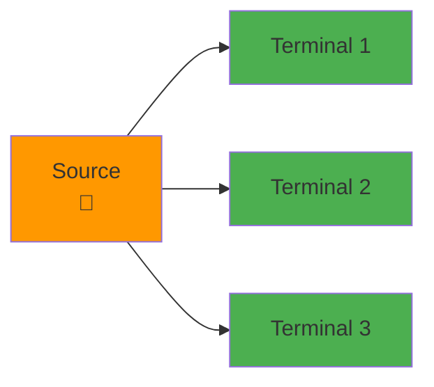

### Pros/Cons:
- ✅ Fast (O(n))
- ❌ Suboptimal wirelength

---

<!-- slide 7 -->
## 🌿 Routing Strategy 2: Steiner Points

### `route_with_steiners()` - Wirelength Optimization

> Inserts **Steiner points** to reduce total wirelength by creating shared paths.

```python
def route_with_steiners(self) -> None:
    for t in self.terminal_positions:
        self.tree.insert_terminal_with_steiner(t, self.keepouts)
```

### The Steiner Problem:

Given $n$ terminals, find minimum spanning tree.

$$\text{Minimize: } \sum_{i,j} w_{ij} \cdot x_{ij}$$

Where $x_{ij} = 1$ if edge $(i,j)$ is in the tree.

### Visual:

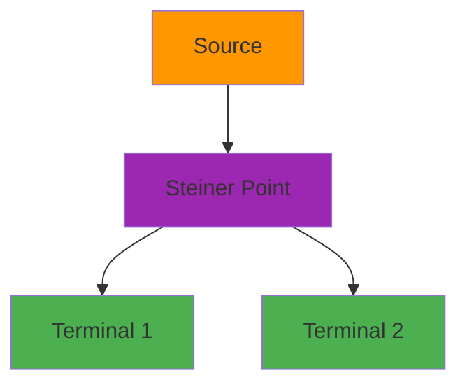

---

<!-- slide 8 -->
## ⏱️ Routing Strategy 3: Constraints

### `route_with_constraints()` - Performance-Driven

> Balances wirelength with timing constraints using $\alpha$ parameter.

```python
def route_with_constraints(self, alpha: float = 1.0) -> None:
    allowed_wirelength = round(self.worst_wirelength * alpha)
    for t in self.terminal_positions:
        self.tree.insert_terminal_with_constraints(
            t, allowed_wirelength, self.keepouts
        )
```

### Constraint Equation:

$$
\text{allowed\_length} = \alpha \times \text{worst\_wirelength}
$$

Where $\alpha \in [0.5, 2.0]$ typically.

### When to Use:

| Scenario | α Value |
|----------|---------|
| High-performance | 0.5 - 0.8 |
| Balanced | 1.0 |
| Relaxed timing | 1.2 - 2.0 |

---

<!-- slide 9 -->
## 🚧 Keepouts Implementation

### What are Keepouts?

> **Keepouts** are rectangular regions that the router must avoid - like pre-routed wires, macros, or IP blocks.

```python
# Define keepouts as intervals
keepouts = [
    Point(Interval(1600, 1900), Interval(1000, 1500)),
    Point(Interval(500, 800), Interval(600, 900)),
]
```

### Visual Representation:

```mermaid
rectangle
    title Keepout Regions
    direction LR
    A[Routing Area]
    B{Keepout 1}
    C{Keepout 2}
    D[Free to Route]

    A --> B
    A --> C
    A --> D
```

### Blocking Detection:

```python
# From routing_tree.py
for keepout in keepouts:
    if (keepout.contains(nearest_pt) or
        keepout.blocks(path1) or
        keepout.blocks(path2) or
        keepout.blocks(path3)):
        block = True
```

---

<!-- slide 10 -->
## 🔍 Keepout Path Avoidance Algorithm

### `_find_insertion_point()` Method

```python
def _find_insertion_point(
    point: Point,
    allowed_wirelength: int,
    keepouts: Optional[List[Point]] = None,
) -> Tuple[Optional[RoutingNode], RoutingNode]:
```

### Algorithm Flow:

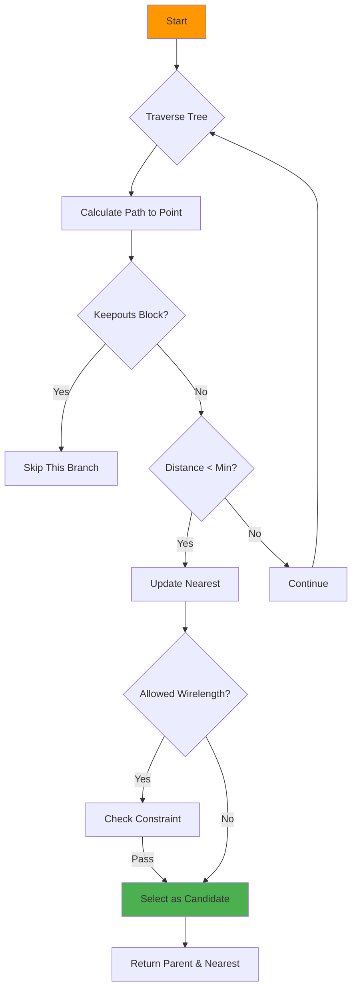

---

<!-- slide 11 -->
## 📦 3D Extension

### Multi-Layer Routing

> The router supports **3D coordinates** - useful for multi-layer chips (e.g., 2D + metal layers).

### 2D vs 3D Point:

```python
# 2D Point
p2d = Point(100, 200)

# 3D Point (x, y, z) where z = layer
p3d = Point(Point(100, 200), 3)  # Layer 3
```

### Visual:

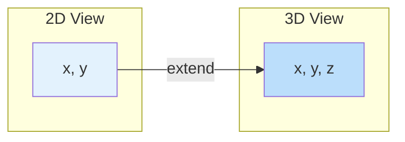

### Distance Calculation:

- **2D**: $d = |x_1 - x_2| + |y_1 - y_2|$ (Manhattan)
- **3D**: $d = |x_1 - x_2| + |y_1 - y_2| + |z_1 - z_2|$

---

<!-- slide 12 -->
## 📊 3D Wirelength Comparison

| Scenario | 2D Wirelength | 3D Wirelength | Savings |
|----------|---------------|---------------|---------|
| Same layer | $L_2$ | $L_2 + 2z$ | - |
| Multi-layer | $L$ | $L/2 + z$ | ✅ ~50% |

### Example from Code:

```python
>>> tree2d = GlobalRoutingTree(Point(0, 0))
>>> tree2d.insert_steiner_node(Point(2, 2))
>>> tree2d.calculate_total_wirelength()
4

>>> tree3d = GlobalRoutingTree(Point(Point(0, 0), 0))
>>> tree3d.insert_steiner_node(Point(Point(2, 2), 2))
>>> tree3d.calculate_total_wirelength()
6  # 2 + 2 + 2 (includes z-layer cost)
```

---

<!-- slide 13 -->
## 🖼️ Visualization Examples - 2D

### 1. Routing with Steiner Points

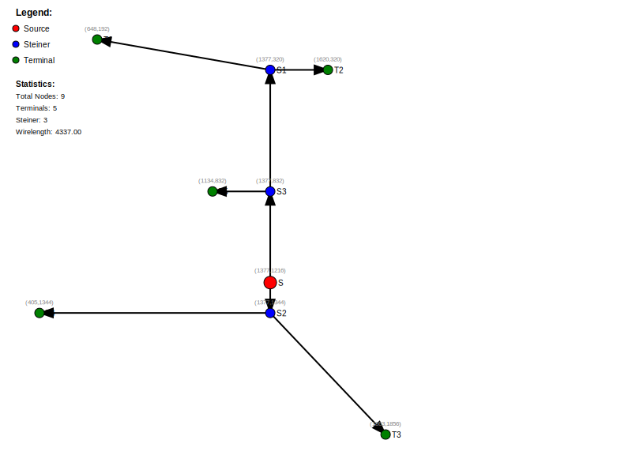

*Optimal wirelength using Steiner points*

---

<!-- slide 14 -->
## 🖼️ With Constraints

### 2. Routing with Timing Constraints

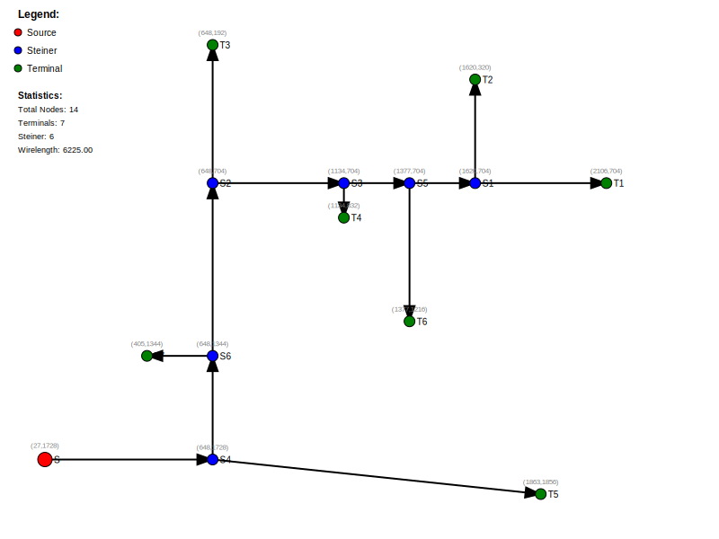

*Performance-driven routing with timing budget*

---

<!-- slide 15 -->
## 🖼️ With Keepouts

### 3. Routing with Obstacles

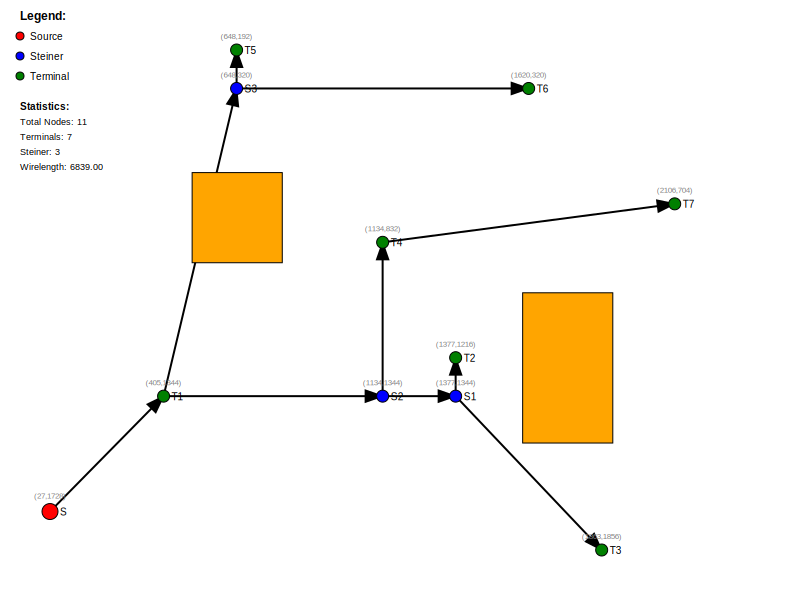

*Routes detour around gray keepout regions*

---

<!-- slide 16 -->
## 🖼️ Steiner + Keepouts

### 4. Optimal Routing with Obstacles

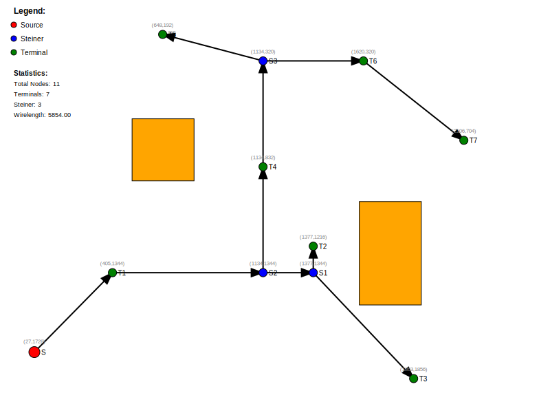

*Combines Steiner optimization with keepout avoidance*

---

<!-- slide 17 -->
## 🖼️ 3D Routing Examples

### 5. 3D Routing with Steiner Points

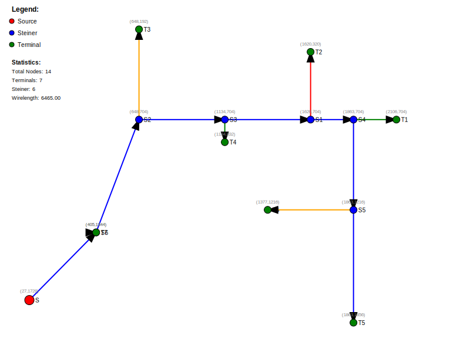

---

### 6. 3D with Constraints & Keepouts

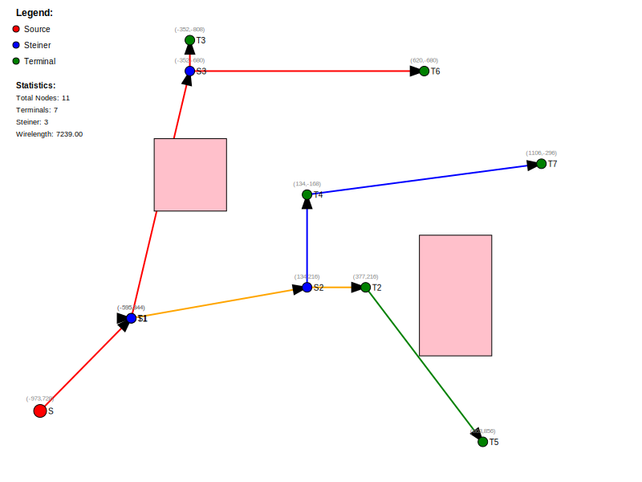

---

<!-- slide 17 -->
## 💻 Code Demo

### Basic Usage

```python
from physdes.point import Point
from physdes.router.global_router import GlobalRouter

# Define source and terminals
source = Point(0, 0)
terminals = [Point(10, 0), Point(5, 5), Point(8, 3)]

# Create router
router = GlobalRouter(source, terminals)

# Choose strategy
router.route_simple()          # Fast, direct
# or
router.route_with_steiners()   # Optimal wirelength
# or
router.route_with_constraints(1.0)  # With timing budget
```

---

<!-- slide 18 -->
### With Keepouts

```python
from physdes.interval import Interval

# Define keepout regions
keepouts = [
    Point(Interval(4, 6), Interval(-1, 1)),  # Block in middle
]

router = GlobalRouter(source, terminals, keepouts)
router.route_with_steiners()

# Calculate total wirelength
total_wl = router.tree.calculate_total_wirelength()
print(f"Total wirelength: {total_wl}")
```

---

<!-- slide 19 -->
### With 3D Coordinates

```python
# 3D routing (e.g., 2-metal layer design)
source_3d = Point(Point(0, 0), 0)      # Layer 0
terminals_3d = [
    Point(Point(10, 1), 1),  # Layer 1
    Point(Point(5, 2), 2),   # Layer 2
]

router_3d = GlobalRouter(source_3d, terminals_3d)
router_3d.route_with_steiners()
```

---

<!-- slide 20 -->
### Visualization

```python
from physdes.router.routing_visualizer import (
    save_routing_tree_svg,
    visualize_routing_tree_svg
)

# Generate SVG string
svg = visualize_routing_tree_svg(
    router.tree,
    keepouts,
    width=1000,
    height=1000
)
print(svg)

# Save to file
save_routing_tree_svg(
    router.tree,
    keepouts,
    filename="my_route.svg"
)
```

---

<!-- slide 21 -->
## 📈 Algorithm Complexity

| Operation | Time Complexity |
|-----------|----------------|
| `route_simple()` | $O(n \cdot m)$ |
| `route_with_steiners()` | $O(n \cdot m \cdot k)$ |
| `_find_insertion_point()` | $O(m)$ per call |

Where:
- $n$ = number of terminals
- $m$ = nodes in tree
- $k$ = number of keepouts

---

<!-- slide 22 -->
## 🔬 Key Data Structures

### Point Class (Generic)

```python
class Point(T1, T2):
    """Supports both 2D and 3D coordinates"""

    xcoord: T1  # int or Interval
    ycoord: T2  # int or Interval
```

### RoutingNode

```python
class RoutingNode:
    id: str
    type: NodeType  # SOURCE, STEINER, TERMINAL
    pt: Point
    children: List[RoutingNode]
    parent: Optional[RoutingNode]
    path_length: int  # for constraint checking
```

---

<!-- slide 23 -->
## 🎯 Key Algorithms

### 1. Nearest Node Search

```python
def _find_nearest_node(self, point: Point) -> RoutingNode:
    """Find node with minimum Manhattan distance"""
    nearest = self.source
    min_distance = self.source.manhattan_distance(target)

    for node in self.nodes.values():
        dist = node.manhattan_distance(target)
        if dist < min_distance:
            nearest = node
    return nearest
```

### 2. Steiner Point Insertion

```python
def insert_terminal_with_steiner(self, point, keepouts=None):
    parent, nearest = self._find_insertion_point(point, 10*12, keepouts)

    if parent is None:
        nearest.add_child(terminal)
    else:
        # Insert Steiner point on the branch
        nearest_pt = possible_path.nearest_to(point)
        steiner = RoutingNode(..., nearest_pt)
        # Reconnect: parent -> steiner -> nearest + terminal
```

---

<!-- slide 24 -->
## 🧪 Testing

### Run Tests

```bash
# All tests
pytest

# Specific test
pytest tests/test_global_router_with_keepouts.py -v

# With coverage
pytest --cov physdes --cov-report term-missing
```

### Test Coverage:

| Module | Tests |
|--------|-------|
| `global_router.py` | ✅ `test_route_*` |
| `routing_tree.py` | ✅ Tree operations |
| `keepouts` | ✅ `test_global_router_with_keepouts.py` |
| `3D` | ✅ `test_global_router3d*.py` |

---

<!-- slide 25 -->
## 📊 Output Examples - Global Router

### 2D Routing Results

| Image | Description |
|-------|-------------|
|  | Routing with Steiner points |
|  | Routing with timing constraints |
|  | Routing with keepout obstacles |
|  | Steiner points + keepouts |

### 3D Routing Results

| Image | Description |
|-------|-------------|
|  | 3D routing with Steiner points |
|  | 3D with constraints & keepouts |

---

<!-- slide 26 -->
## 🔄 Flow Diagram

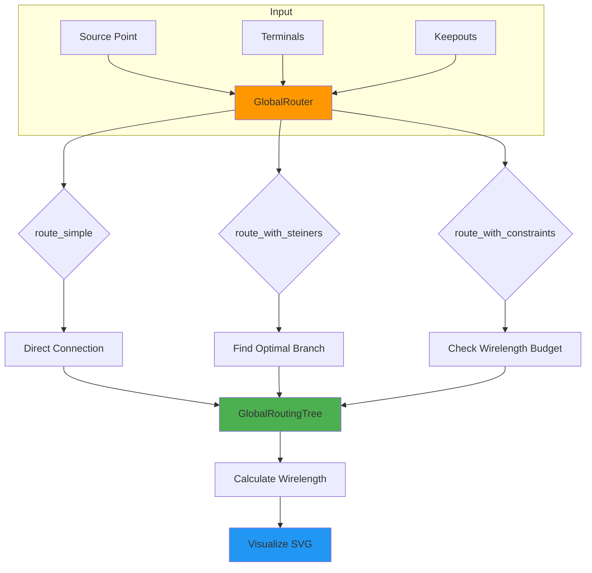

---

<!-- slide 27 -->
## 💡 Design Patterns Used

### 1. Strategy Pattern

> Different routing algorithms as interchangeable strategies.

```python
# GlobalRouter supports multiple strategies
router.route_simple()           # Strategy A
router.route_with_steiners()    # Strategy B
router.route_with_constraints() # Strategy C
```

### 2. Composite Pattern

> Routing tree as hierarchical structure.

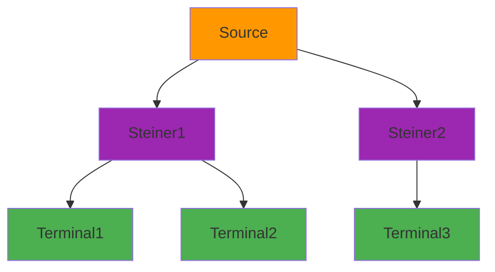

---

<!-- slide 28 -->
## 🔧 Extensions & Future Work

### Potential Enhancements

| Feature | Description | Difficulty |
|---------|-------------|------------|
| **Congestion-aware** | Consider track usage | ⭐⭐⭐ |
| **Timing-driven** | Use slack-based costs | ⭐⭐⭐ |
| **Power routing** | Optimize for IR drop | ⭐⭐⭐ |
| **Net ordering** | Priority-based routing | ⭐⭐ |
| **Layer assignment** | Auto metal layer select | ⭐⭐ |

### Related Projects

- [physdes-cpp](https://github.com/luk036/physdes-cpp) - C++ implementation
- [physdes-rs](https://github.com/luk036/physdes-rs) - Rust implementation

---

<!-- slide 29 -->
## 📚 References

### Papers
- **VLSI Physical Design**: A comprehensive textbook on global routing algorithms
- **Steiner Tree Problem**: NP-hard optimization in VLSI routing

### Code References
- `src/physdes/router/global_router.py` - Main router
- `src/physdes/router/routing_tree.py` - Tree data structure
- `src/physdes/router/routing_visualizer.py` - SVG generation

### Documentation
```bash
# Generate docs
sphinx-build -b html docs/ docs/_build/html

# View at http://localhost:8000
```

---

<!-- slide 30 -->
## ✅ Summary

### What We Covered:

1. **GlobalRouter** class with 3 routing strategies
2. **Keepouts** for obstacle avoidance
3. **3D extension** for multi-layer chips
4. **Visualization** via SVG output
5. **Code examples** and test cases

### Key Takeaways:

- ✅ Steiner points reduce wirelength significantly
- ✅ Keepouts enable routing around obstacles
- ✅ 3D coordinates support modern multi-layer designs
- ✅ Modular design allows easy extension

---

<!-- slide 31 -->
## 🏁 Q&A

<div align="center">

### Questions?

{width=300px}

</div>

### Contact
- GitHub: [luk036/physdes-py](https://github.com/luk036/physdes-py)
- Documentation: [physdes-py.readthedocs.io](https://physdes-py.readthedocs.io/)

---

<!-- slide 32 -->
## 📎 Appendix: Mathematical Formulas

### Manhattan Distance

$$d_2((x_1, y_1), (x_2, y_2)) = |x_1 - x_2| + |y_1 - y_2|$$

### 3D Manhattan Distance

$$d_3((x_1, y_1, z_1), (x_2, y_2, z_2)) = |x_1 - x_2| + |y_1 - y_2| + |z_1 - z_2|$$

### Wirelength Budget

$$\text{budget} = \alpha \times \max_i (\text{dist}(source, terminal_i))$$

---

<!-- slide 33 -->
## 📎 Appendix: Point Class API

### Creation

```python
# 2D
p = Point(100, 200)

# 2D with intervals (for keepouts)
p = Point(Interval(10, 20), Interval(30, 40))

# 3D
p3d = Point(Point(100, 200), 3)  # (x,y), layer
```

### Methods

| Method | Description |
|--------|-------------|
| `min_dist_with(other)` | Manhattan distance |
| `hull_with(other)` | Bounding box (Interval) |
| `contains(point)` | Point in rect? |
| `blocks(path)` | Path intersects rect? |
| `nearest_to(point)` | Closest point on rect edge |

---

<!-- slide 34 -->
## 📎 Appendix: File Structure

```
physdes-py/
├── src/physdes/
│   ├── router/
│   │   ├── global_router.py      # Main router ⭐
│   │   ├── routing_tree.py       # Tree structure ⭐
│   │   └── routing_visualizer.py # SVG output
│   ├── point.py                  # Point/Interval classes
│   ├── interval.py               # Interval arithmetic
│   └── cts/
│       └── dme_algorithm.py       # Clock tree synthesis
├── tests/
│   ├── test_global_router*.py    # Router tests
│   └── test_routing_tree*.py     # Tree tests
├── outputs/                       # Generated SVGs
│   ├── example_route*.svg
│   └── *clock_tree*.svg
└── README.md
```

---

<!-- slide 35 -->
## Appendix: Mermaid Diagram Styles

### Color Legend

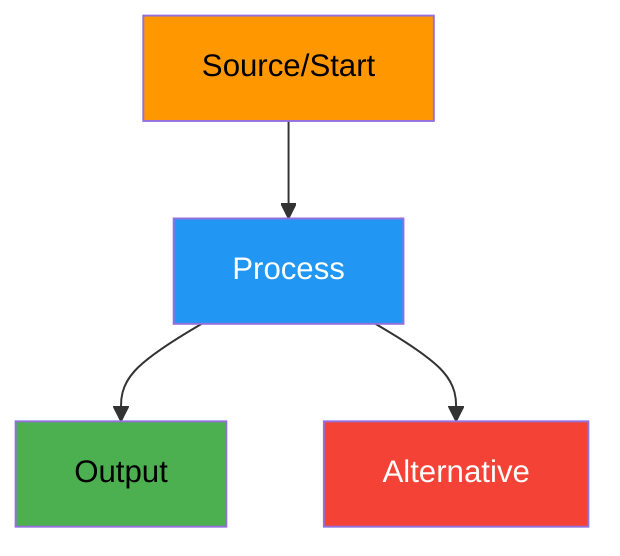

| Color | Meaning |
|-------|---------|
| 🟠 Orange | Start/Source |
| 🔵 Blue | Process/Action |
| 🟢 Green | Success/Output |
| 🔴 Red | Error/Alternative |

---

<!-- slide 36 -->
## 🎬 End of Presentation

<div align="center">

### Thank you! 🎉

**physdes-py** - VLSI Physical Design Python Library


</div>
