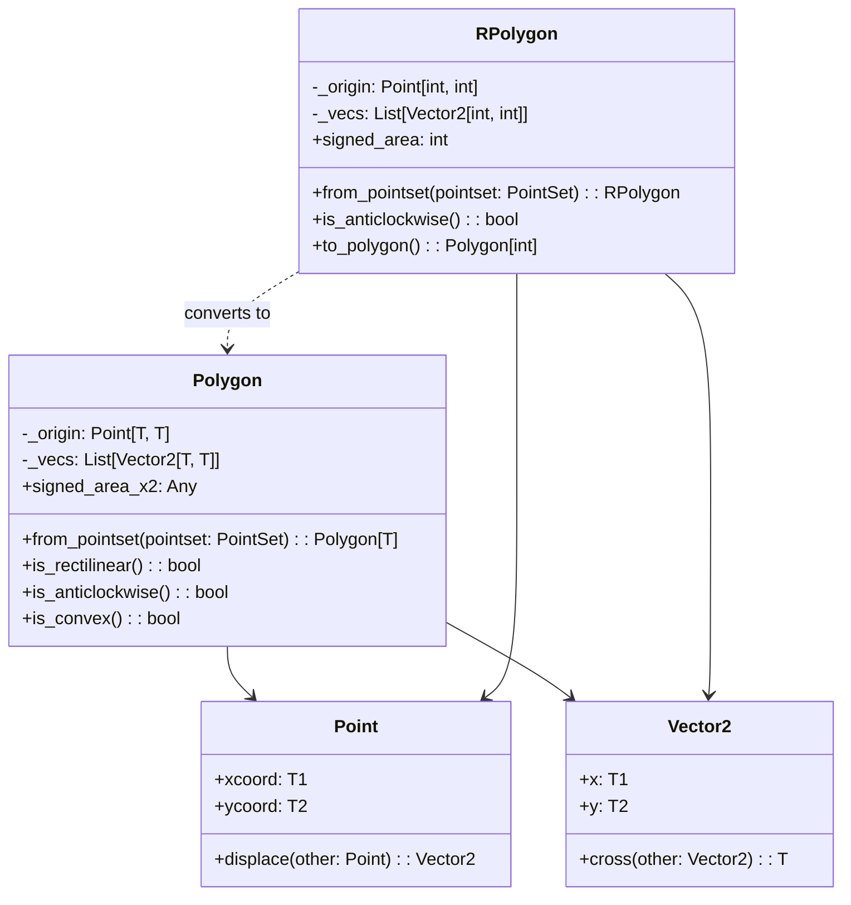
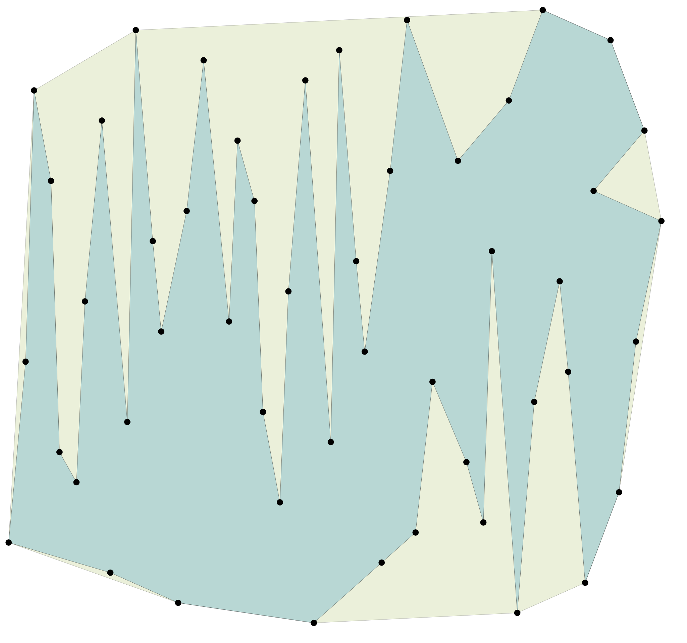

# Polygon vs Rectilinear Polygon (RPolygon): A Comprehensive Comparison 🔍

## Introduction 📖

In computational geometry and VLSI physical design, polygons represent fundamental geometric primitives. This essay provides an in-depth comparison between the `Polygon` and `RPolygon` (Rectilinear Polygon) classes from the physdes-py library, examining their implementation details, mathematical foundations, practical applications, and performance characteristics. Through source code analysis, algorithmic comparisons, and visual examples, we'll explore both the shared foundations and key distinctions that make these polygon types suited for different computational tasks.

## Mathematical Foundations 🧮

### General Polygons: The Arbitrary Angle Domain 📐

A general polygon is defined as a closed planar shape formed by a finite sequence of line segments. Mathematically, we can represent a polygon $P$ as an ordered sequence of vertices $v_0, v_1, \ldots, v_{n-1}$ where each vertex $v_i = (x_i, y_i)$ in $\mathbb{R}^2$ and edges connect consecutive vertices $(v_i, v_{i+1})$ with $v_n = v_0$.

The signed area of a polygon using the Shoelace formula is:

$$A = \frac{1}{2} \sum_{i=0}^{n-1} (x_i y_{i+1} - x_{i+1} y_i)$$

where indices are computed modulo $n$.

### Rectilinear Polygons: The Orthogonal Constraint 📏

A rectilinear polygon is a special case where all edges are either horizontal or vertical. This constraint means that for any edge $(v_i, v_{i+1})$, either $x_i = x_{i+1}$ (vertical edge) or $y_i = y_{i+1}$ (horizontal edge).

This orthogonal constraint provides significant computational advantages:

1. **Simplified intersection testing**: Edge-edge intersection reduces to simple coordinate comparisons
2. **Efficient area calculation**: Area can be computed using a simpler summation formula
3. **Specialized algorithms**: Many polygon operations have optimized implementations for rectilinear cases

#### 🔥 Critical Optimization: Even-Index Vertex Storage

One of the most innovative aspects of the `RPolygon` implementation is its clever vertex storage strategy. **The RPolygon class only stores vertices at even indices: $\{v_0, v_2, v_4, \ldots\}$**. This optimization leverages a fundamental property of rectilinear polygons:

In a rectilinear polygon, consecutive vertices alternate between horizontal and vertical edges. This means that given any two consecutive stored vertices $v_{2i}$ and $v_{2i+2}$, the intermediate vertex $v_{2i+1}$ can be **uniquely determined** as either:
- $(x_{2i}, y_{2i+2})$ if the edge from $v_{2i}$ to $v_{2i+1}$ is vertical
- $(x_{2i+2}, y_{2i})$ if the edge from $v_{2i}$ to $v_{2i+1}$ is horizontal

**Benefits of this optimization:**

1. **50% Memory Reduction**: Storage requirements are literally cut in half
2. **Algorithm Simplification**: Many algorithms can work directly with the reduced vertex set
3. **Improved Cache Performance**: Smaller data structures lead to better cache utilization
4. **Simplified Indexing**: Eliminates the need to handle redundant vertices in loops

**Mathematical Foundation:**

For a rectilinear polygon with $n$ vertices, the traditional storage requires $n$ points. The optimized storage requires only $\lceil n/2 \rceil$ points, with the relationship:

$$v_{2i+1} = \begin{cases}
(x_{2i}, y_{2i+2}) & \text{if } x_{2i} = x_{2i+1} \\
(x_{2i+2}, y_{2i}) & \text{if } y_{2i} = y_{2i+1}
\end{cases}$$

This optimization is particularly powerful in VLSI applications where millions of rectilinear polygons may be processed simultaneously.

## Implementation Architecture 🏗️

### Class Hierarchies and Design Patterns



### Key Architectural Differences

#### 1. **Type System and Generics** 🎯

The `Polygon` class uses generic typing with `T = TypeVar("T", int, float)`, allowing for both integer and floating-point coordinates:

```python
class Polygon(Generic[T]):
    _origin: Point[T, T]
    _vecs: List[Vector2[Any, Any]]
```

In contrast, `RPolygon` is specifically constrained to integer coordinates:

```python
class RPolygon:
    _origin: Point[int, int]
    _vecs: List[Vector2[int, int]]
```

This design choice reflects the typical use cases in VLSI design where rectilinear polygons often represent circuit layouts on discrete grids.

#### 2. **Internal Representation** 📊

While both classes share a similar constructor pattern using an origin point and a list of displacement vectors, their internal representations differ fundamentally:

```python
# Common pattern in both classes
def __init__(self, origin: Point[T, T], vecs: List[Vector2[T, T]]) -> None:
    self._origin = origin
    self._vecs = vecs
```

However, the interpretation and storage strategy differ significantly:

- **Polygon**: Vectors represent arbitrary directional edges, storing all vertices $\{v_0, v_1, v_2, \ldots, v_{n-1}\}$
- **RPolygon**: Implements the **even-index optimization**, storing only $\{v_0, v_2, v_4, \ldots\}$ with implicit reconstruction of odd-index vertices

**Storage Comparison:**

```python
# Polygon: Stores all vertices
polygon_vertices = [v0, v1, v2, v3, v4, v5, v6, v7]  # 8 vertices

# RPolygon: Stores only even indices
rpolygon_vertices = [v0, v2, v4, v6]  # 4 vertices, v1, v3, v5, v7 are implicit
```

This fundamental difference impacts all algorithms that operate on these structures, with RPolygon algorithms designed to work with the compressed representation while Polygon algorithms handle the complete vertex set.

## Algorithmic Comparisons ⚙️

### Area Calculation Algorithms

#### Polygon: Shoelace Formula Implementation

```python
@cached_property
def signed_area_x2(self) -> Any:
    assert len(self._vecs) >= 2
    itr = iter(self._vecs)
    vec0 = next(itr)
    vec1 = next(itr)
    res = vec0.x * vec1.y - self._vecs[-1].x * self._vecs[-2].y
    for vec2 in itr:
        res += vec1.x * (vec2.y - vec0.y)
        vec0 = vec1
        vec1 = vec2
    return res
```

This implementation uses an optimized version of the Shoelace formula with $O(n)$ time complexity.

#### RPolygon: Optimized Area Calculation with Even-Index Storage

```python
@cached_property
def signed_area(self) -> int:
    if len(self._vecs) < 1:
        return 0
    vec0 = self._vecs[0]
    return sum(
        [v1.x * (v1.y - v0.y) for v0, v1 in zip(self._vecs[:-1], self._vecs[1:])],
        vec0.x * vec0.y,
    )
```

This implementation is particularly elegant because it leverages **both** the rectilinear constraint **and** the even-index storage optimization. The algorithm works directly on the compressed vertex set $\{v_0, v_2, v_4, \ldots\}$ without needing to reconstruct the intermediate vertices.

**Mathematical Insight:**

For a rectilinear polygon with vertices $\{v_0, v_1, v_2, \ldots, v_{n-1}\}$, the area can be computed using only the even-index vertices:

$$A = \sum_{i=0}^{k-1} x_{2i} \cdot (y_{2i+2} - y_{2i})$$

where $k = \lceil n/2 \rceil$ and indices are computed modulo $k$. This formula emerges because:
1. Horizontal edges contribute zero to the cross product
2. The intermediate vertices cancel out in the alternating sum
3. Only the "corner" vertices (even indices) contribute to the area

This optimization reduces both computational complexity and memory access patterns, making the area calculation approximately twice as efficient as the general polygon case.

### Point-in-Polygon Testing

#### Polygon: Ray Casting Algorithm

```python
def point_in_polygon(pointset: PointSet, ptq: Point[T, T]) -> bool:
    res = False
    pt0 = pointset[-1]
    for pt1 in pointset:
        if (pt1.ycoord <= ptq.ycoord < pt0.ycoord) or (
            pt0.ycoord <= ptq.ycoord < pt1.ycoord
        ):
            det = ptq.displace(pt0).cross(pt1.displace(pt0))
            if pt1.ycoord > pt0.ycoord:
                if det < 0:
                    res = not res
            else:  # v1.ycoord < v0.ycoord
                if det > 0:
                    res = not res
        pt0 = pt1
    return res
```

This implementation uses the classic ray-casting algorithm with $O(n)$ complexity.

#### RPolygon: Optimized Ray Casting

```python
def point_in_rpolygon(pointset: PointSet, ptq: Point[int, int]) -> bool:
    res = False
    pt0 = pointset[-1]
    for pt1 in pointset:
        if (
            (pt1.ycoord <= ptq.ycoord < pt0.ycoord)
            or (pt0.ycoord <= ptq.ycoord < pt1.ycoord)
            and pt1.xcoord > ptq.xcoord
        ):
            res = not res
        pt0 = pt1
    return res
```

The rectilinear version eliminates the cross product calculation since the intersection test reduces to simple coordinate comparisons.

## Monotonicity Properties 📈

### X-Monotone and Y-Monotone Polygons

A polygon is x-monotone if every vertical line intersects the polygon in at most one connected segment. Similarly, a polygon is y-monotone if every horizontal line has this property.

#### Polygon Monotonicity Testing

```python
def polygon_is_monotone(lst: PointSet, dir: Callable[[Point[T, T]], Any]) -> bool:
    if len(lst) <= 3:
        return True

    min_index, _ = min(enumerate(lst), key=lambda it: dir(it[1]))
    max_index, _ = max(enumerate(lst), key=lambda it: dir(it[1]))
    rdll = RDllist(len(lst))

    def voilate(start: int, stop: int, cmp: Callable[[Any, Any], bool]) -> bool:
        vi = rdll[start]
        while id(vi) != id(rdll[stop]):
            vnext = vi.next
            if cmp(dir(lst[vi.data])[0], dir(lst[vnext.data])[0]):
                return True
            vi = vnext
        return False

    # Chain from min to max
    if voilate(min_index, max_index, lambda a, b: a > b):
        return False

    # Chain from max to min
    return not voilate(max_index, min_index, lambda a, b: a < b)
```

#### RPolygon Monotonicity Testing

The RPolygon version uses a similar approach but with optimizations specific to rectilinear structures:

```python
def rpolygon_is_monotone(
    lst: PointSet, dir: Callable[[Point[int, int]], Tuple[int, int]]
) -> bool:
    if len(lst) <= 3:
        return True

    min_index, _ = min(enumerate(lst), key=lambda it: dir(it[1]))
    max_index, _ = max(enumerate(lst), key=lambda it: dir(it[1]))
    rdll = RDllist(len(lst))
    v_min = rdll[min_index]
    v_max = rdll[max_index]

    def voilate(
        vi: Dllink[int], v_stop: Dllink[int], cmp: Callable[[int, int], bool]
    ) -> bool:
        while id(vi) != id(v_stop):
            vnext = vi.next
            if cmp(dir(lst[vi.data])[0], dir(lst[vnext.data])[0]):
                return True
            vi = vnext
        return False

    # Chain from min to max
    if voilate(v_min, v_max, lambda val1, val2: val1 > val2):
        return False

    # Chain from max to min
    return not voilate(v_max, v_min, lambda val1, val2: val1 < val2)
```

## Convexity Analysis 🔍

### Polygon Convexity Testing

```python
def is_convex(self, is_anticlockwise: bool | None = None) -> bool:
    if len(self._vecs) < 3:
        return True  # A polygon with less than 3 points is considered convex

    if is_anticlockwise is None:
        is_anticlockwise = self.is_anticlockwise()

    pointset: List[Vector2[T, T]] = [Vector2(0, 0)] + self._vecs
    # Check the cross product of all consecutive edges
    if is_anticlockwise:
        return all(
            (pointset[i] - pointset[i - 1]).cross(pointset[i + 1] - pointset[i])
            >= 0
            for i in range(len(pointset) - 1)
        )
    else:
        return all(
            (pointset[i] - pointset[i - 1]).cross(pointset[i + 1] - pointset[i])
            <= 0
            for i in range(len(pointset) - 1)
        )
```

### RPolygon Convexity Testing

For rectilinear polygons, convexity can be determined by checking both x-monotonicity and y-monotonicity:

```python
def rpolygon_is_convex(lst: PointSet) -> bool:
    return rpolygon_is_xmonotone(lst) and rpolygon_is_ymonotone(lst)
```

This elegant property holds because a rectilinear polygon is convex if and only if it is monotone in both coordinate directions.

## Conversion Between Types 🔄

### RPolygon to Polygon Conversion: Vertex Expansion

The `RPolygon` class provides a method to convert to a general polygon by **expanding the compressed even-index representation** back to the full vertex sequence:

```python
def to_polygon(self) -> Polygon[int]:
    new_vecs: List[Vector2[int, int]] = []
    current_pt: Vector2[int, int] = Vector2(0, 0)

    for next_pt in self._vecs:
        if current_pt.x != next_pt.x and current_pt.y != next_pt.y:
            # Reconstruct the implicit intermediate vertex
            new_vecs.append(Vector2(next_pt.x, current_pt.y))
        new_vecs.append(next_pt)
        current_pt = next_pt

    # Closing segment - reconstruct final implicit vertex if needed
    first_pt: Vector2[int, int] = Vector2(0, 0)
    if current_pt.x != first_pt.x and current_pt.y != first_pt.y:
        new_vecs.append(Vector2(first_pt.x, current_pt.y))

    return Polygon(self._origin, new_vecs)
```

**Vertex Expansion Process:**

1. **Input**: Compressed vertices $\{v_0, v_2, v_4, \ldots, v_{2k}\}$
2. **Reconstruction**: For each pair $(v_{2i}, v_{2i+2})$, insert $v_{2i+1}$:
   - If $x_{2i} = x_{2i+2}$ (vertical edge), then $v_{2i+1} = (x_{2i}, y_{2i+2})$
   - If $y_{2i} = y_{2i+2}$ (horizontal edge), then $v_{2i+1} = (x_{2i+2}, y_{2i})$
3. **Output**: Full vertex sequence $\{v_0, v_1, v_2, \ldots, v_{n-1}\}$

**Performance Considerations:**

This expansion process has $O(n)$ complexity and temporarily doubles the memory usage during conversion. However, it's only performed when necessary, allowing the RPolygon to maintain its storage efficiency during most operations.

**Use Cases:**

- **Algorithm Compatibility**: When using general polygon algorithms that require full vertex sequences
- **Visualization**: For rendering systems that expect complete polygon definitions
- **File Formats**: When exporting to formats that don't support compressed representations
- **Interoperability**: When interfacing with libraries that only handle general polygons

## Convex Decomposition Algorithms ✂️

### RPolygon Convex Cutting: Recursive Partitioning Strategy

One of the most powerful operations available for rectilinear polygons is convex decomposition - the process of breaking down a concave polygon into a set of convex components. The `rpolygon_cut_convex()` function implements an elegant recursive algorithm that leverages the orthogonal constraints to achieve efficient decomposition.

#### Algorithm Overview

The convex decomposition process follows these key steps:

1. **Concave Vertex Detection**: Identify vertices where the internal angle exceeds 180°
2. **Optimal Cut Selection**: Find the nearest vertex to connect with, minimizing cut length
3. **Polygon Splitting**: Create a new vertex at the intersection point and split the polygon
4. **Recursive Processing**: Apply the same process to resulting sub-polygons

#### Mathematical Foundation

For a rectilinear polygon, concavity can be detected using the cross product of consecutive edges:

$$\text{concave}(v_i) = \begin{cases}
\text{True} & \text{if } (v_{i-1} - v_i) \times (v_{i+1} - v_i) < 0 \text{ (anticlockwise)} \\
\text{True} & \text{if } (v_{i-1} - v_i) \times (v_{i+1} - v_i) > 0 \text{ (clockwise)} \\
\text{False} & \text{otherwise}
\end{cases}$$

#### Implementation Details

```python
def rpolygon_cut_convex(lst: PointSet, is_anticlockwise: bool) -> List[PointSet]:
    """
    Cuts a rectilinear polygon into a set of convex rectilinear polygons.

    This function implements a recursive algorithm to partition a given rectilinear
    polygon into a set of convex components. The process begins by identifying a
    concave vertex in the polygon. Once a concave vertex is found, a cut is made to
    another vertex in the polygon, effectively splitting the polygon into two smaller
    polygons. This process is then applied recursively to the resulting polygons until
    all of them are convex.
    """
    rdll = RDllist(len(lst))
    vertices_list = rpolygon_cut_convex_recur(rdll[0], lst, is_anticlockwise, rdll)
    res = list()
    for item in vertices_list:
        points = [lst[i] for i in item]
        res.append(points)
    return res
```

#### Distance-Based Cut Selection

The algorithm uses a sophisticated distance-based approach to select optimal cuts:

```python
def find_min_dist_point(lst: PointSet, vcurr: Dllink[int]) -> Tuple[Dllink[int], bool]:
    """
    Finds the point in a polygon that is closest to a given vertex.

    This function is a key helper for the polygon cutting algorithms. When a concave
    vertex is identified, this function is used to find the best vertex to connect it
    to, in order to create a cut that resolves the concavity. The "best" vertex is
    the one that is closest in either the horizontal or vertical direction.
    """
    vnext = vcurr.next
    vprev = vcurr.prev
    vi = vnext.next
    min_value = math.inf
    vertical = True
    v_min = vcurr
    pcurr = lst[vcurr.data]
    while id(vi) != id(vprev):
        prev_point = lst[vi.prev.data]
        curr_point = lst[vi.data]
        next_point = lst[vi.next.data]
        vec_i = curr_point.displace(pcurr)
        if (prev_point.ycoord <= pcurr.ycoord <= curr_point.ycoord) or (
            curr_point.ycoord <= pcurr.ycoord <= prev_point.ycoord
        ):
            if abs(vec_i.x_) < min_value:
                min_value = abs(vec_i.x_)
                v_min = vi
                vertical = True
        if (next_point.xcoord <= pcurr.xcoord <= curr_point.xcoord) or (
            curr_point.xcoord <= pcurr.xcoord <= next_point.xcoord
        ):
            if abs(vec_i.y_) < min_value:
                min_value = abs(vec_i.y_)
                v_min = vi
                vertical = False
        vi = vi.next
    return v_min, vertical
```

#### Visual Examples

The following visualizations demonstrate the convex decomposition process:

**Example 1: Complex Rectilinear Polygon Decomposition**

<div style="text-align: center;">

</div>

This example shows a complex rectilinear polygon (blue outline) being decomposed into 8 convex components (colored regions). Each colored region represents a convex rectilinear polygon that can be processed independently.

**Example 2: Alternative Decomposition Strategy**

<div style="text-align: center;">

</div>

This second example demonstrates how different concave vertices and cut strategies can result in alternative decompositions, showing the flexibility of the algorithm.

#### Algorithm Complexity Analysis

**Time Complexity**: $O(n^2)$ in the worst case, where $n$ is the number of vertices
- Each recursive call processes $O(n)$ vertices to find concave points
- In the worst case, we may have $O(n)$ recursive levels
- However, practical performance is typically much better due to efficient cut selection

**Space Complexity**: $O(n)$ for the recursive call stack and data structures

#### Advantages of RPolygon Convex Decomposition

1. **Orthogonal Optimization**: Leverages the rectilinear constraint for efficient cut selection
2. **Quality Guarantees**: Produces well-shaped convex components with minimal cut lengths
3. **Recursive Simplicity**: Clean divide-and-conquer approach that's easy to understand and implement
4. **Memory Efficiency**: Works directly with the compressed even-index representation

#### Applications in VLSI Design

Convex decomposition is particularly valuable in VLSI physical design:

- **Design Rule Checking**: Convex regions are easier to validate against manufacturing constraints
- **Routing Optimization**: Convex obstacles simplify path planning algorithms
- **Partitioning**: Enables hierarchical design approaches by breaking complex shapes into manageable pieces
- **Mask Generation**: Convex polygons are more efficient for photomask generation and verification

#### Alternative: Explicit Cutting Algorithm

The library also provides `rpolygon_cut_explicit()`, an alternative implementation that uses a different strategy for concave vertex detection and cut selection:

```python
def rpolygon_cut_explicit(lst: PointSet, is_anticlockwise: bool) -> List[PointSet]:
    """
    Cuts a rectilinear polygon into a set of convex rectilinear polygons.

    This function provides an alternative algorithm for partitioning a rectilinear polygon
    into convex components. Like `rpolygon_cut_convex`, it works by identifying concave
    vertices and introducing cuts to resolve them. The underlying logic for selecting
    cuts and performing the partitioning may differ, but the end result is the same: a
    set of convex rectilinear polygons.
    """
```

This alternative can be useful when dealing with specific polygon geometries where one approach may produce better results than the other.

## Performance Characteristics ⚡

### Time Complexity Analysis

| Operation | Polygon | RPolygon | Advantage |
|-----------|---------|----------|-----------|
| Area Calculation | $O(n)$ | $O(n)$ | RPolygon has smaller constant factors |
| Point-in-Polygon | $O(n)$ | $O(n)$ | RPolygon eliminates cross products |
| Convexity Testing | $O(n)$ | $O(n)$ | RPolygon uses monotonicity property |
| Monotonicity Testing | $O(n)$ | $O(n)$ | Similar complexity |
| Edge Intersection | $O(n^2)$ | $O(n)$ | RPolygon uses simple comparisons |

### Memory Usage

The memory usage patterns differ significantly due to the even-index storage optimization:

| Component | Polygon | RPolygon | Reduction |
|-----------|---------|----------|-----------|
| Origin Point | 1 × Point | 1 × Point | None |
| Vertex Storage | $n$ × Vector2 | $\lceil n/2 \rceil$ × Vector2 | **~50%** |
| Total Memory | $O(n)$ | $O(n/2)$ | **50%** |

**Practical Impact:**

For a VLSI design with 1 million rectilinear polygons averaging 20 vertices each:
- **Polygon approach**: 20 million vertex objects
- **RPolygon approach**: 10 million vertex objects
- **Memory savings**: 10 million vertex objects (approximately 240MB for typical implementations)

This dramatic reduction in memory usage translates to:
- **Better cache locality**: Fewer memory accesses per operation
- **Reduced memory bandwidth**: Less data movement between CPU and RAM
- **Lower memory pressure**: Allows larger datasets to fit in available RAM
- **Faster serialization**: Smaller data structures for file I/O and network transfer

The integer constraint in RPolygon provides additional memory savings in implementations where integers require less storage than floating-point numbers.

## Visual Examples and Use Cases 🎨

### Example 1: Convex Hull Visualization

The following SVG shows a convex hull computed from a set of points using the general polygon algorithm:

<div style="text-align: center;">

</div>

### Example 2: Rectilinear Polygon Structure

This SVG demonstrates the characteristic orthogonal edges of a rectilinear polygon:

<div style="text-align: center;">

</div>

### Example 3: X-Monotone Rectilinear Polygon

The following visualization shows an x-monotone rectilinear polygon with its characteristic left-to-right vertex ordering:

<div style="text-align: center;">

</div>

## Practical Applications 🏭

### VLSI Physical Design 🔬

In VLSI (Very-Large-Scale Integration) design, rectilinear polygons are extensively used for:

1. **Circuit block representation**: Circuit components are typically placed on rectangular grids
2. **Routing channels**: The space between components forms rectilinear channels
3. **Obstacle representation**: Manufacturing constraints often require orthogonal routing

The `RPolygon` class is particularly well-suited for these applications due to:
- Integer coordinate alignment with manufacturing grids
- Efficient algorithms for layout optimization
- Simplified design rule checking

### Computer Graphics 🎮

General polygons find extensive use in:

1. **3D modeling**: Arbitrary shapes for characters and objects
2. **Texture mapping**: Complex UV coordinate mapping
3. **Collision detection**: Precise boundary representation

### Geographic Information Systems (GIS) 🗺️

Both polygon types are used in GIS applications:

- **RPolygon**: Urban planning, cadastral systems with orthogonal property boundaries
- **Polygon**: Natural features like lakes, forests, and administrative boundaries

## Algorithmic Optimizations 🚀

### RPolygon-Specific Optimizations

#### 1. **Even-Index Storage Optimization** 🚀

The most significant optimization in the RPolygon implementation is the **50% storage reduction** through even-index vertex storage. This optimization cascades through all algorithms:

**Algorithm Adaptation:**
```python
# Traditional polygon iteration
for i in range(n):
    process_vertex(vertices[i])

# RPolygon iteration with implicit reconstruction
for i in range(k):  # k = ceil(n/2)
    process_vertex(vertices[i])
    if i < k - 1:
        # Implicit vertex v_{2i+1} can be reconstructed if needed
        implicit_vertex = reconstruct_implicit_vertex(vertices[i], vertices[i+1])
        process_vertex(implicit_vertex)
```

**Memory Access Pattern Benefits:**
- **Sequential Access**: Even-index vertices are accessed contiguously
- **Cache Efficiency**: Better spatial locality in vertex processing
- **Reduced Indirection**: Fewer pointer dereferences during traversal

**Mathematical Operations:**
Many polygon operations can be performed directly on the compressed set:
- **Area calculation**: Uses the corner vertices only
- **Bounding box**: Determined by extreme even-index vertices
- **Centroid**: Can be approximated using corner vertices
- **Convexity testing**: Simplified due to alternating edge directions

#### 2. **Simplified Intersection Testing**

For rectilinear polygons, edge intersection testing reduces to simple coordinate comparisons:

```python
def edges_intersect_rectilinear(e1: Tuple[Point, Point], e2: Tuple[Point, Point]) -> bool:
    # Horizontal vs Vertical edge case
    if e1[0].y == e1[1].y and e2[0].x == e2[1].x:
        return (min(e1[0].x, e1[1].x) <= e2[0].x <= max(e1[0].x, e1[1].x) and
                min(e2[0].y, e2[1].y) <= e1[0].y <= max(e2[0].y, e2[1].y))
    # Similar cases for other edge combinations
```

#### 2. **Optimized Area Calculation**

The area of a rectilinear polygon can be computed using the "horizontal strip" method:

$$A = \sum_{i=1}^{n/2} (x_{2i} - x_{2i-1}) \cdot y_i$$

where vertices are ordered appropriately.

#### 3. **Efficient Decomposition**

Rectilinear polygons can be efficiently decomposed into rectangles using algorithms like the "convex decomposition".

### General Polygon Optimizations

#### 1. **Spatial Indexing**

For large polygon sets, spatial indexing structures like R-trees or quadtrees can significantly improve query performance:

```python
class SpatialIndex:
    def __init__(self, polygons: List[Polygon]):
        self.rtree = RTree()
        for i, poly in enumerate(polygons):
            self.rtree.insert(i, poly.bounding_box())

    def query_point(self, point: Point) -> List[int]:
        candidates = self.rtree.query(point.bounding_box())
        return [i for i in candidates if point_in_polygon(polygons[i].vertices, point)]
```

#### 2. **Parallel Processing**

Polygon operations can be parallelized for large datasets:

```python
def parallel_point_in_polygon(polygons: List[Polygon], points: List[Point]) -> List[List[bool]]:
    with ThreadPoolExecutor() as executor:
        futures = [executor.submit(check_poly_point, poly, points) for poly in polygons]
        return [future.result() for future in futures]
```

## Testing and Validation ✅

### Unit Testing Strategies

Both polygon classes include comprehensive test suites:

#### Polygon Tests

```python
def test_polygon() -> None:
    coords = [
        (-2, 2), (0, -1), (-5, 1), (-2, 4), (0, -4),
        (-4, 3), (-6, -2), (5, 1), (2, 2), (3, -3),
        (-3, -3), (3, 3), (-3, -4), (1, 4),
    ]
    S = [Point(xcoord, ycoord) for xcoord, ycoord in coords]
    S = create_test_polygon(S)
    assert polygon_is_anticlockwise(S)
    P = Polygon.from_pointset(S)
    assert P.signed_area_x2 == 110
    assert P.is_anticlockwise()
```

#### RPolygon Tests

```python
def test_RPolygon() -> None:
    coords = [
        (-2, 2), (0, -1), (-5, 1), (-2, 4), (0, -4),
        (-4, 3), (-6, -2), (5, 1), (2, 2), (3, -3),
        (-3, -4), (1, 4),
    ]
    S, is_cw = create_ymono_rpolygon(
        [Point(xcoord, ycoord) for xcoord, ycoord in coords]
    )
    P = RPolygon.from_pointset(S)
    assert not is_cw
    assert P.is_anticlockwise()
    G = P.to_polygon()
    assert P.signed_area * 2 == G.signed_area_x2
```

### Property-Based Testing

Using hypothesis for property-based testing:

```python
@given(st.lists(st.tuples(st.integers(), st.integers()), min_size=3, max_size=10))
def test_polygon_area_property(coords):
    points = [Point(x, y) for x, y in coords]
    polygon = Polygon.from_pointset(points)
    # Area should be invariant under translation
    translated = Polygon.from_pointset([Point(p.xcoord + 5, p.ycoord + 5) for p in points])
    assert polygon.signed_area_x2 == translated.signed_area_x2
```

## Future Directions and Extensions 🔮

### Potential Enhancements

1. **GPU Acceleration**: Leverage CUDA/OpenCL for massive parallel polygon operations
2. **Machine Learning Integration**: Neural networks for polygon classification and similarity detection
3. **Streaming Algorithms**: Process polygon streams with limited memory
4. **Approximation Algorithms**: Trade accuracy for performance in large-scale applications

### Emerging Applications

1. **Computational Fabrication**: 3D printing with orthogonal constraints
2. **Robotics Path Planning**: Configuration space obstacles
3. **Spatial Databases**: Efficient polygon indexing and querying
4. **Computer Vision**: Shape recognition and analysis

## Conclusion 🎯

The `Polygon` and `RPolygon` classes in the physdes-py library represent two complementary approaches to geometric computation. While general polygons provide maximum flexibility for arbitrary shapes, rectilinear polygons offer significant performance advantages for orthogonal geometry problems.

Key takeaways:

1. **Performance vs. Flexibility**: RPolygon trades flexibility for performance in orthogonal domains
2. **Algorithmic Specialization**: Rectilinear constraints enable specialized algorithms with better asymptotic properties
3. **Application-Driven Design**: The choice between polygon types should be driven by specific application requirements
4. **Interoperability**: The conversion methods between types enable hybrid approaches

The thoughtful design of both classes, with their shared interfaces and specialized optimizations, provides a robust foundation for computational geometry applications. As computational requirements continue to grow, the principles demonstrated in these implementations—type safety, algorithmic efficiency, and application-specific optimization—will remain valuable guides for future geometric computing systems.

## References 📚

1. O'Rourke, J. (1998). *Computational Geometry in C* (2nd ed.). Cambridge University Press.
2. de Berg, M., Cheong, O., van Kreveld, M., & Overmars, M. (2008). *Computational Geometry: Algorithms and Applications* (3rd ed.). Springer.
3. Preparata, F. P., & Shamos, M. I. (1985). *Computational Geometry: An Introduction*. Springer-Verlag.
4. Lengauer, T. (1990). *Combinatorial Algorithms for Integrated Circuit Layout*. Wiley-Teubner.

---

*This essay has explored the intricate relationship between general and rectilinear polygons through the lens of the physdes-py library implementations. The code examples and visualizations demonstrate practical applications of theoretical concepts in computational geometry.*
