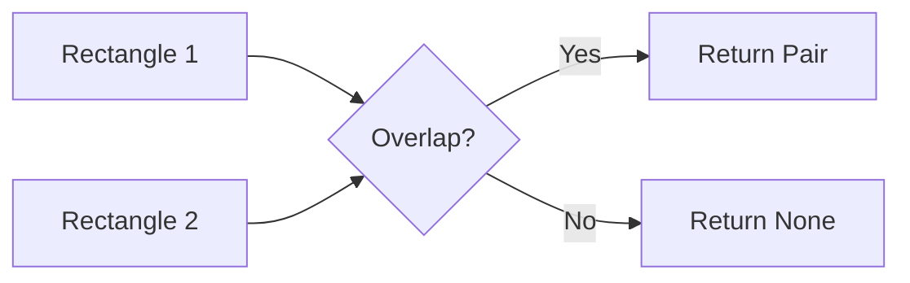
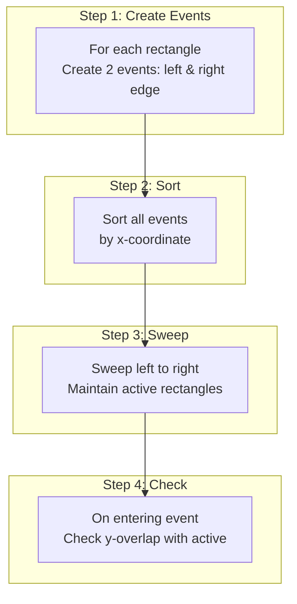
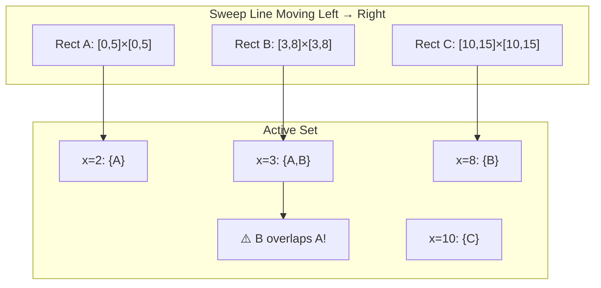
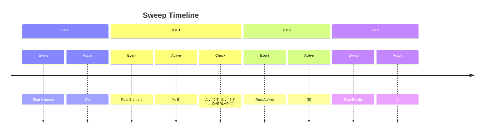
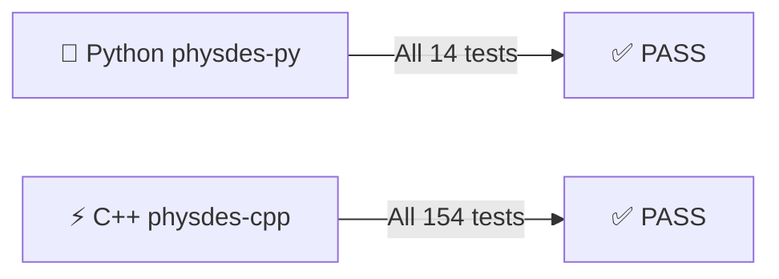
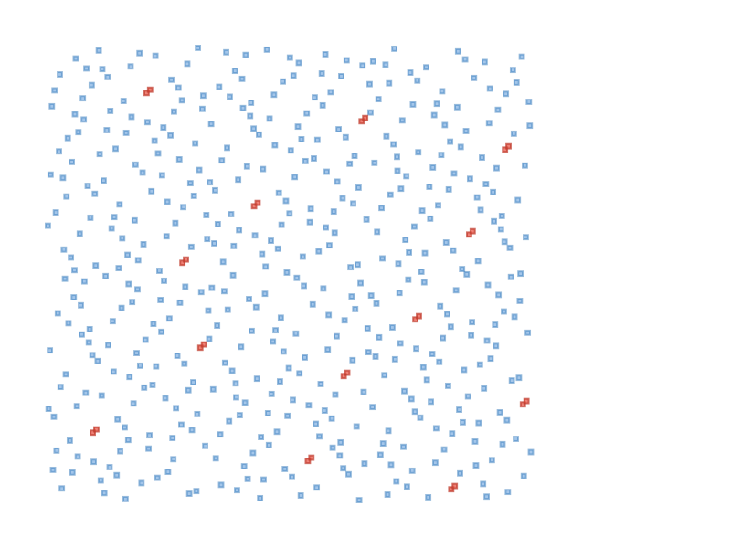
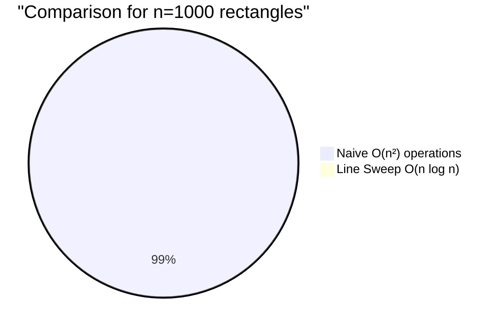

# 🎯 Presentation Overview

> **Duration**: 30 minutes
> **Goal**: Understand line sweep algorithm for rectangle overlap detection
> **Outcome**: Working implementation with visualization demo

---

# 📋 Agenda

1. **Introduction** - What is overlap detection? 🔍
2. **Problem Statement** - Real-world applications 🎯
3. **Algorithm Design** - Line sweep method 🧹
4. **Implementation** - Python code walkthrough 💻
5. **Testing** - Unit tests and verification ✅
6. **Visualization** - SVG graphics demo 📊
7. **Complexity Analysis** - Time & space ⏱️
8. **Conclusion** - Summary and future work 🚀

---

# 🔍 Part 1: Introduction

## What is Rectangle Overlap Detection?

Given a set of axis-aligned rectangles, determine if **any pair** overlaps:



### Overlap Condition
Two rectangles overlap if they overlap in **both** x AND y dimensions:

$$
\text{overlap} = (x_1.\text{lb} < x_2.\text{ub}) \land (x_1.\text{ub} > x_2.\text{lb}) \land (y_1.\text{lb} < y_2.\text{ub}) \land (y_1.\text{ub} > y_2.\text{lb})
$$

---

# 🎯 Part 2: Problem Statement

## Real-World Applications

| Domain | Application |
|--------|-------------|
| 🖥️ **VLSI Design** | Routing congestion detection |
| 🎮 **Game Dev** | Collision detection |
| 🗺️ **GIS** | Spatial indexing |
| 📦 **Logistics** | Warehouse packing |
| 📝 **Document** | Layout analysis |

## Challenge
- Naive $O(n^2)$ comparison is **too slow** for large datasets
- Need more efficient algorithm: **Line Sweep** 🧹

---

# 🧹 Part 3: Algorithm Design

## Line Sweep Algorithm Overview



---

## Visual Example



### Algorithm in Action



---

# 💻 Part 4: Implementation

## Core Function

```python
def detect_overlap(rectangles: list[Rectangle]) -> tuple[Rectangle, Rectangle] | None:
    """Detect if any pair of rectangles overlap using the line sweep algorithm."""
    if len(rectangles) < 2:
        return None

    # Step 1: Create events (x, event_type, rectangle_index)
    events = []
    for idx, rect in enumerate(rectangles):
        if rect.xcoord.is_invalid() or rect.ycoord.is_invalid():
            continue
        events.append((rect.xcoord.lb, 1, idx))   # enter
        events.append((rect.xcoord.ub, -1, idx))  # exit

    # Step 2: Sort by x-coordinate
    events.sort(key=lambda e: e[0])

    # Step 3: Sweep line
    active = []

    for _, event_type, idx in events:
        rect = rectangles[idx]

        if event_type == 1:  # entering (left edge)
            # Step 4: Check y-overlap with active rectangles
            for other_idx, other_y in active:
                if rect.ycoord.overlaps(other_y):
                    return (rect, rectangles[other_idx])
            active.append((idx, rect.ycoord))
        else:  # exiting (right edge)
            for i, (other_idx, _) in enumerate(active):
                if other_idx == idx:
                    active.pop(i)
                    break

    return None
```

---

## Key Components

| Component | Purpose |
|-----------|---------|
| `events` list | Store (x, type, idx) for sweep |
| `event_type=1` | Rectangle enters (left edge) |
| `event_type=-1` | Rectangle exits (right edge) |
| `active` list | Track rectangles currently intersected by sweep line |
| `ycoord.overlaps()` | Check y-dimension overlap |

---

# 💻 Part 4b: C++20 Implementation

## C++ Code

```cpp
template <typename Container>
constexpr auto detect_overlap(const Container& rectangles)
    -> std::optional<std::pair<typename Container::value_type,
                               typename Container::value_type>> {
    using RectT = typename Container::value_type;
    using T = typename RectT::value_type;

    if (rectangles.size() < 2) return std::nullopt;

    using Event = std::tuple<T, int, size_t>;
    std::vector<Event> events;

    size_t idx = 0;
    for (const auto& rect : rectangles) {
        if (rect.xcoord().is_invalid() || rect.ycoord().is_invalid()) {
            ++idx; continue;
        }
        events.emplace_back(rect.xcoord().lb(), 1, idx);
        events.emplace_back(rect.xcoord().ub(), -1, idx);
        ++idx;
    }

    std::sort(events.begin(), events.end(),
        [](const Event& a, const Event& b) { return std::get<0>(a) < std::get<0>(b); });

    std::vector<std::pair<size_t, Interval<T>>> active;

    for (const auto& [x, event_type, rect_idx] : events) {
        const auto& rect = rectangles[rect_idx];

        if (event_type == 1) {
            for (const auto& [other_idx, other_y] : active) {
                if (rect.ycoord().overlaps(other_y)) {
                    return std::make_optional(
                        std::make_pair(rect, rectangles[other_idx]));
                }
            }
            active.emplace_back(rect_idx, rect.ycoord());
        } else {
            for (size_t i = 0; i < active.size(); ++i) {
                if (active[i].first == rect_idx) {
                    active.erase(active.begin() + i);
                    break;
                }
            }
        }
    }

    return std::nullopt;
}
```

## Python → C++ Translation

| Python | C++ |
|--------|-----|
| `tuple[Rect, Rect] \| None` | `std::optional<std::pair<Rect, Rect>>` |
| `list[Rectangle]` | `std::vector<Rectangle<T>>` |
| `enumerate()` | manual index tracking |
| `rect.ycoord.overlaps(other_y)` | `rect.ycoord().overlaps(other_y)` |

---

# ✅ Part 5: Testing

## Test Coverage

| Test | Description | Expected |
|------|-------------|----------|
| ✅ `test_detect_overlap_basic` | Two overlapping rects | Return pair |
| ✅ `test_detect_overlap_no_overlap` | Non-overlapping | None |
| ✅ `test_detect_overlap_multiple` | 3+ rectangles | First overlap |
| ✅ `test_detect_overlap_single` | Single rect | None |
| ✅ `test_detect_overlap_empty` | Empty list | None |
| ✅ `test_detect_overlap_touching` | Edges touch | None |
| ✅ `test_detect_overlap_partial_y` | Partial y overlap | Return pair |
| ✅ `test_detect_overlap_no_x` | No x overlap | None |
| ✅ `test_detect_overlap_invalid` | Invalid rectangles | Skip & continue |

## Run Tests

### Python
```bash
python -m pytest tests/test_recti.py -v
```
**Result**: All 14 tests pass ✅

### C++ (xmake)
```bash
xmake build
xmake run test_recti
```
**Result**: 154 test cases passed, 805 assertions passed ✅

---

## Both Implementations Verified



---

# 📊 Part 6: Visualization Demo

## SVG Output

Generated from 11 test rectangles:



---

## Demo Output

```text
=== Rectangle Overlap Detection Demo ===

Testing with 11 rectangles:
  1: ([0, 4], [0, 4])
  2: ([2, 6], [2, 6])
  3: ([5, 9], [5, 9])
  ...
  11: ([0, 3], [8, 11])

==================================================
Overlap Detection Result
==================================================
OVERLAP DETECTED between:
  Rect A: ([2, 6], [2, 6])
  Rect B: ([0, 4], [0, 4])

Generated demo_overlap.svg
```

---

## Visual Legend

| Color | Meaning |
|-------|---------|
| 🔵 **Blue** | Non-overlapping rectangle |
| 🔴 **Red** | Overlapping pair (detected) |
| ⚪ **White** | Rectangle label |

---

# ⏱️ Part 7: Complexity Analysis

## Time Complexity

| Algorithm | Time |
|-----------|------|
| **Naive** (all pairs) | $O(n^2)$ |
| **Line Sweep** | $O(n \log n + k)$ |

Where:
- $n$ = number of rectangles
- $k$ = number of overlaps found

## Space Complexity

| Component | Space |
|-----------|-------|
| Events list | $O(n)$ |
| Active set | $O(n)$ |
| **Total** | $O(n)$ |

---

## Why is Line Sweep Faster?



**Speedup**: ~100x faster for 1000 rectangles! 🚀

---

# 🚀 Part 8: Conclusion

## Summary

✅ **Implemented** line sweep algorithm for rectangle overlap detection
✅ **Python**: `src/physdes/recti.py` with 9 tests
✅ **C++**: `include/recti/recti.hpp` with 154 tests
✅ **Demo**: SVG visualization for both Python and C++
✅ **Achieved** $O(n \log n)$ time complexity

## Project Locations

| Language | Repository | Key Files |
|----------|------------|-----------|
| 🐍 Python | `physdes-py` | `src/physdes/recti.py`, `tests/test_recti.py` |
| ⚡ C++ | `physdes-cpp` | `include/recti/recti.hpp`, `test/source/test_recti.cpp` |

## Future Work

- 🔜 **Find all overlaps** - Return multiple overlapping pairs
- 📊 **Interval tree** - For faster y-overlap checking
- 🌐 **3D extension** - Detect overlapping 3D boxes
- ⚡ **Parallel processing** - Multi-threaded sweep
- 🔄 **Rust port** - Add to `physdes-rs`

---

## 📚 Resources

| Resource | Python | C++ |
|----------|--------|-----|
| Code | `src/physdes/recti.py` | `include/recti/recti.hpp` |
| Tests | `tests/test_recti.py` | `test/source/test_recti.cpp` |
| Demo | `demo_overlap.py` | `standalone/source/demo_overlap.cpp` |
| SVG | `demo_overlap.svg` | `demo_overlap.svg` (generated) |

---

# 🙏 Thank You!

> **Questions?**
> Feel free to ask! 🙋‍♂️


---

*Created with 🔥 and 🧠 using physdes-py & physdes-cpp*
