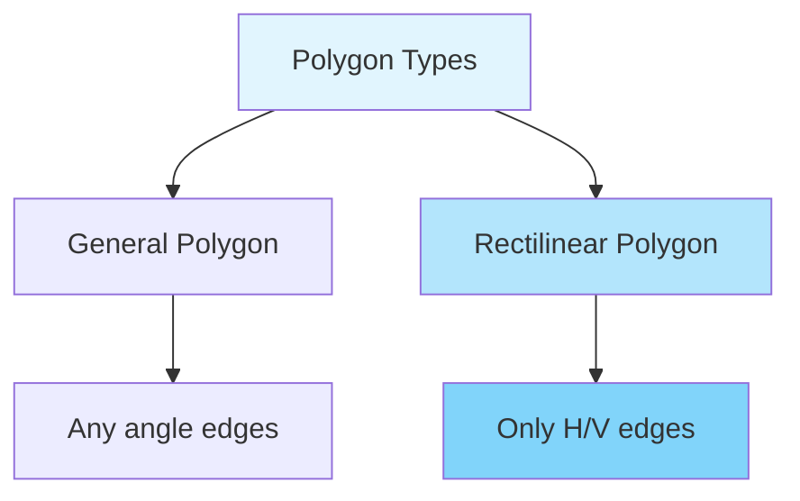
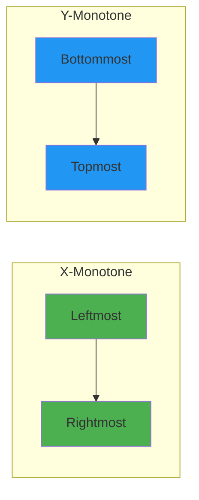
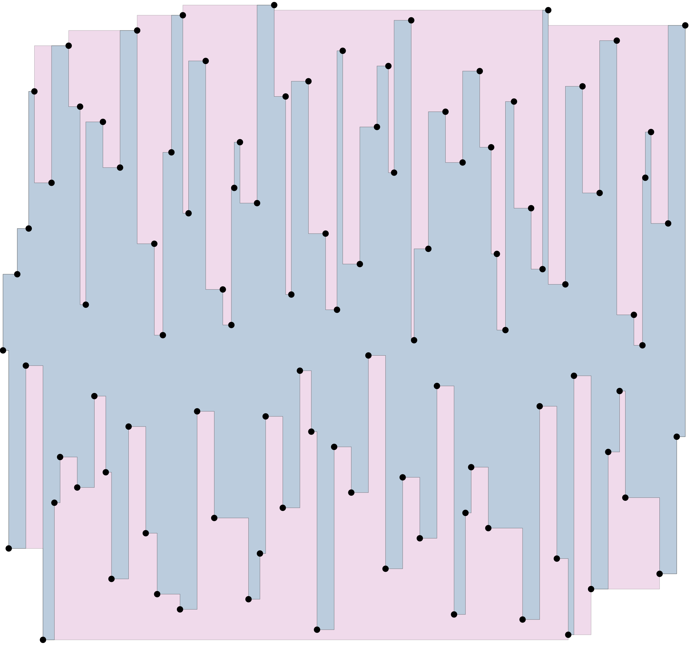
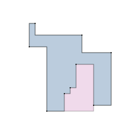
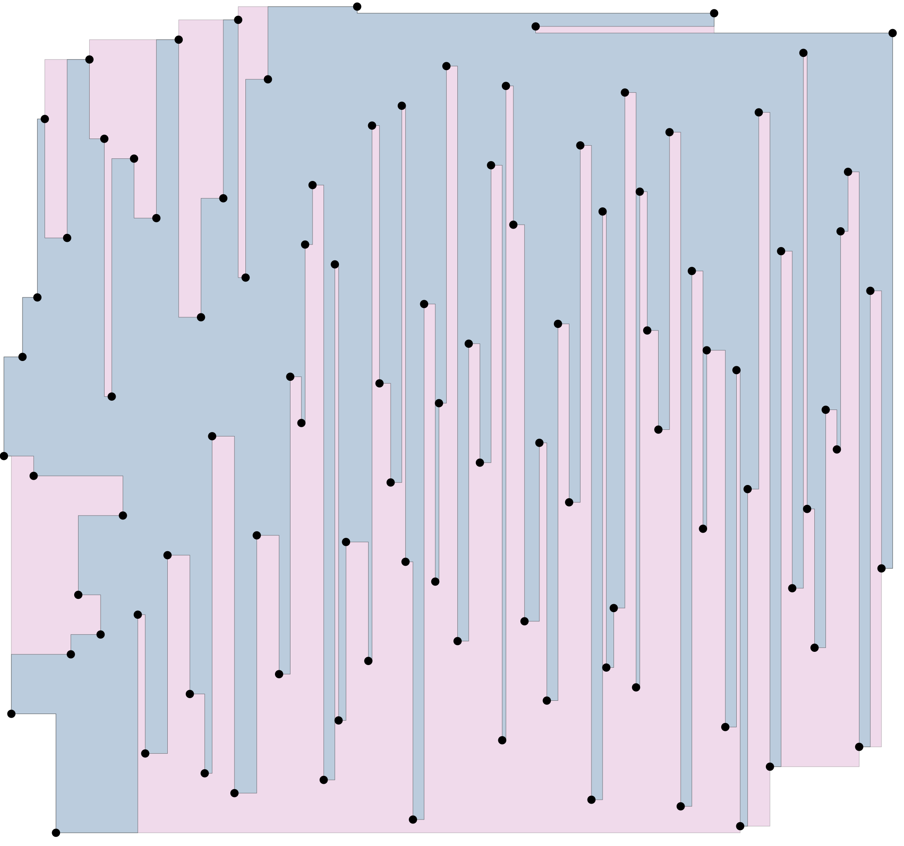
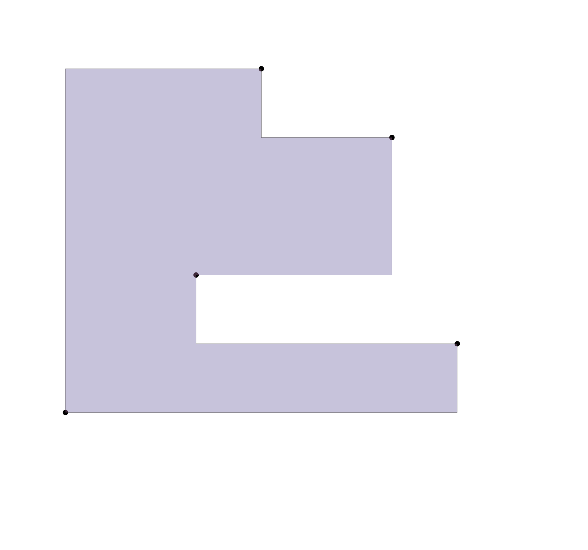
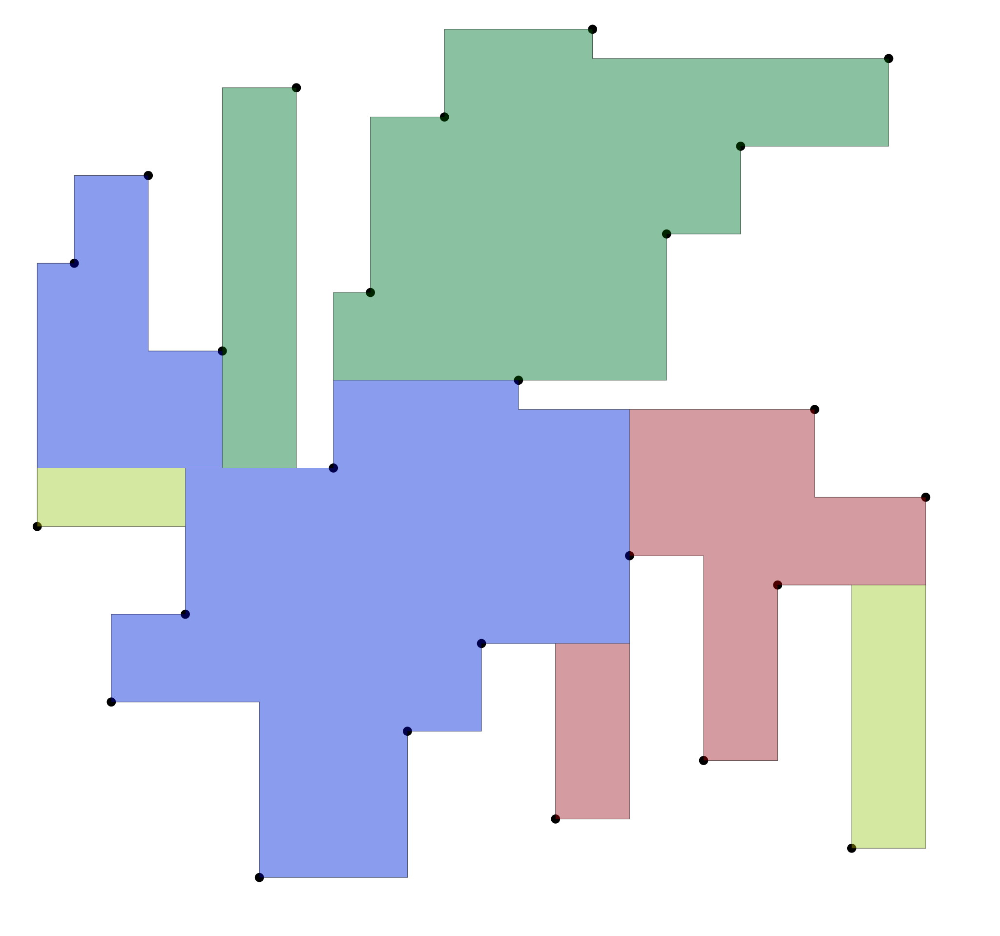
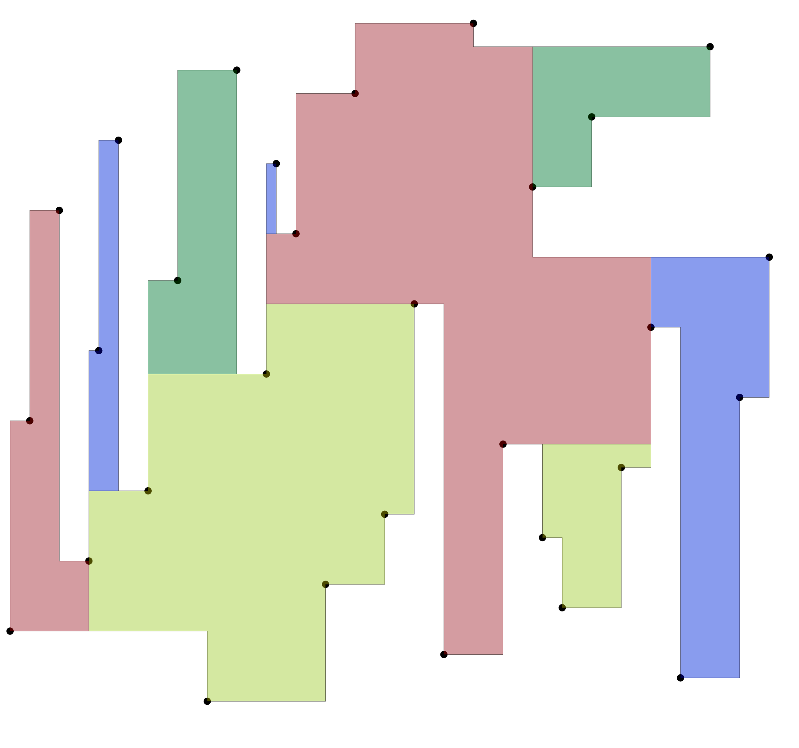
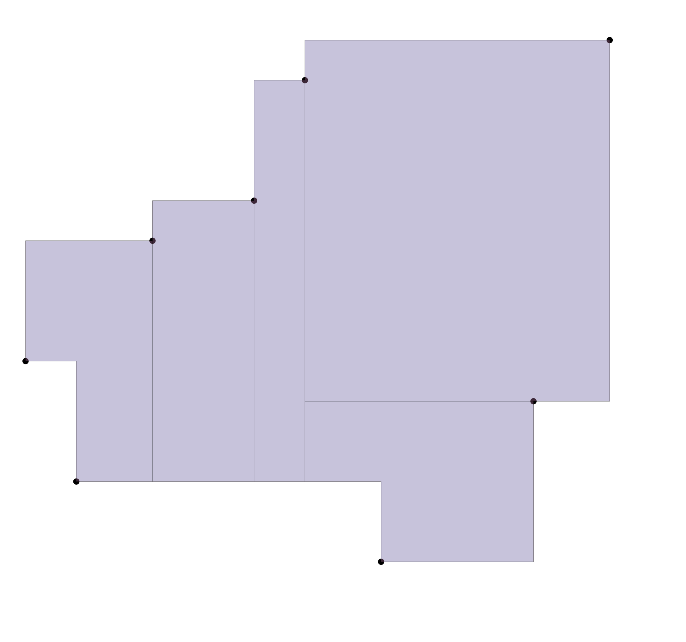
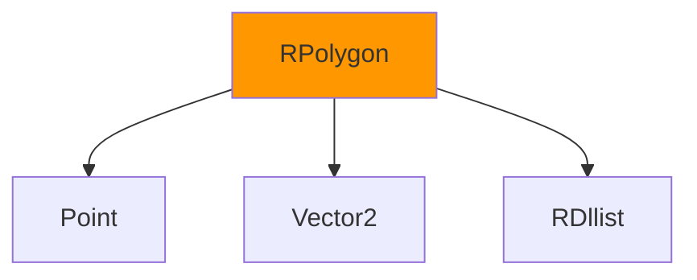

<!-- slide 1 -->
# 📐 Rectilinear Polygon: Representation and Algorithms

### VLSI Physical Design Computational Geometry

<div align="center">


</div>

---

<!-- slide 2 -->
## 📋 Agenda

1. **Introduction** - What is a Rectilinear Polygon? 🎯
2. **Representation** - Origin + Vectors Approach 📦
3. **Basic Operations** - Area, Orientation, Conversion ⚙️
4. **Monotone Polygons** - X/Y-Monotone Creation 🔄
5. **Convex Hull** - X/Y-Monotone and Full Convex 🛡️
6. **Point Inclusion** - Ray-Casting Algorithm 🔍
7. **Polygon Cutting** - Convex Decomposition ✂️
8. **Visualization** - SVG Output Examples 🖼️
9. **Code Demo** - Implementation 💻
10. **Summary & Applications** 🔮

---

<!-- slide 3 -->
## 🎯 What is a Rectilinear Polygon?

> A **rectilinear polygon** (or orthogonal polygon) is a polygon whose edges are **either horizontal or vertical**.



### Key Properties:
- ✅ Edges alternate between horizontal and vertical
- ✅ Interior angles are either 90° or 270°
- ✅ Common in **VLSI layout**, **floorplanning**, **routing**

---

<!-- slide 4 -->
## 📐 Example: Rectilinear vs General

```
General Polygon:          Rectilinear Polygon:

      /\
     /  \                 ┌──────┐
    /    \                │      │
   /      \               │      └────┐
  /        \              │            │
 /__________\             └────────────┘

  Any angles               Only 90°/270° corners
```

### Why Rectilinear?
- ✅ Matches Manhattan geometry of VLSI circuits
- ✅ Simplified collision detection
- ✅ Efficient area calculation
- ✅ Natural representation for routing grids

---

<!-- slide 5 -->
## 📦 Representation: Origin + Vectors

### Internal Data Structure

```python
class RPolygon:
    _origin: Point[int, int]           # Reference point
    _vecs: List[Vector2[int, int]]      # Edge vectors from origin
```

### Visualization

```
.. svgbob::
   :align: center

   (origin) +──v1──>┐
              │     │
              │     v2
              v0<──┘

   Origin: (400, 500)
   Vectors: [(0,-4), (0,-1), (3,-3), (5,1), ...]
```

### Key Insight:
> Vectors are stored **relative to origin**, enabling efficient translation.

---

<!-- slide 6 -->
## 🔧 Creating RPolygons

### Method 1: From Point Set

```python
@classmethod
def from_pointset(cls, pointset: PointSet) -> "RPolygon":
    """Create polygon from a list of points"""
    origin = pointset[0]
    vecs = [vtx.displace(origin) for vtx in pointset[1:]]
    return cls(origin, vecs)
```

### Method 2: Direct Construction

```python
def __init__(self, origin: Point[int, int], vecs: List[Vector2[int, int]]):
    self._origin = origin
    self._vecs = vecs
```

### Example:

```python
coords = [(0,0), (0,1), (1,1), (1,0)]
points = [Point(x, y) for x, y in coords]
poly = RPolygon.from_pointset(points)
```

---

<!-- slide 7 -->
## ➕➖ Translation Operations

### In-Place Addition/Subtraction

```python
def __iadd__(self, rhs: Vector2[int, int]) -> "RPolygon":
    """Translate polygon by adding vector to origin"""
    self._origin += rhs
    return self

def __isub__(self, rhs: Vector2[int, int]) -> "RPolygon":
    """Translate polygon by subtracting vector from origin"""
    self._origin -= rhs
    return self
```

### Usage:

```python
poly = RPolygon.from_pointset(points)
poly += Vector2(10, 5)  # Move right 10, up 5
poly -= Vector2(3, 0)   # Move left 3
```

### Why in-place?
- ✅ Memory efficient
- ✅ Useful for incremental placement

---

<!-- slide 8 -->
## 📐 Signed Area Calculation

### Using the Shoelace Formula

```python
@cached_property
def signed_area(self) -> int:
    """Calculate signed area of the polygon"""
    if len(self._vecs) < 1:
        return 0
    vec0 = self._vecs[0]
    return sum(
        [v1.x * (v1.y - v0.y) for v0, v1 in zip(self._vecs[:-1], self._vecs[1:])],
        vec0.x * vec0.y,
    )
```

### Formula:

$$A = \frac{1}{2} \sum_{i=0}^{n-1} (x_i y_{i+1} - x_{i+1} y_i)$$

### Example:

```python
coords = [(0,0), (0,1), (1,1), (1,0)]
P = RPolygon.from_pointset([Point(x,y) for x,y in coords])
print(P.signed_area)  # -1 (clockwise)
```

---

<!-- slide 9 -->
## 🔄 Orientation Detection

### Clockwise vs Anticlockwise

```python
def is_anticlockwise(self) -> bool:
    """Check if polygon is anticlockwise"""
    pointset = [Vector2(0, 0)] + self._vecs

    # Find minimum coordinate point (bottom-left)
    min_index, min_point = min(enumerate(pointset),
                               key=lambda it: (it[1].x, it[1].y))

    prev_point = pointset[(min_index - 1) % len(pointset)]
    return prev_point.y > min_point.y
```

### Key Insight:
> Uses the **bottom-leftmost vertex** as reference to determine orientation.

---

<!-- slide 10 -->
## 🔃 Convert to Standard Polygon

### RPolygon → Polygon

```python
def to_polygon(self) -> Polygon[int]:
    """Convert rectilinear polygon to standard polygon"""
    new_vecs = []
    current_pt = Vector2(0, 0)

    for next_pt in self._vecs:
        if current_pt.x != next_pt.x and current_pt.y != next_pt.y:
            # Add intermediate point for diagonal
            new_vecs.append(Vector2(next_pt.x, current_pt.y))
        new_vecs.append(next_pt)
        current_pt = next_pt

    # Handle closing segment
    first_pt = Vector2(0, 0)
    if current_pt.x != first_pt.x and current_pt.y != first_pt.y:
        new_vecs.append(Vector2(first_pt.x, current_pt.y))

    return Polygon(self._origin, new_vecs)
```

---

<!-- slide 11 -->
## 🔄 Monotone Polygon Creation

### What is a Monotone Polygon?

> A polygon is **monotone** if a line in a given direction intersects it at most twice.



### Types:
| Type | Description |
|------|-------------|
| **X-Monotone** | Every vertical line cuts at most twice |
| **Y-Monotone** | Every horizontal line cuts at most twice |

---

<!-- slide 12 -->
## 🔧 Creating X-Monotone Polygon

### Algorithm

```python
def create_xmono_rpolygon(lst: PointSet) -> Tuple[PointSet, bool]:
    """
    Create x-monotone rectilinear polygon.
    Returns: (pointset, is_anticlockwise)
    """
    return create_mono_rpolygon(
        lst,
        lambda pt: (pt.xcoord, pt.ycoord),  # Sort by x, then y
        lambda a, b: a < b
    )
```

### Process:

1. Find **leftmost** and **rightmost** points
2. Partition points into **upper** and **lower** chains
3. Sort each chain in the appropriate direction
4. Concatenate: **lower chain** + **upper chain**

---

<!-- slide 13 -->
## 📊 X-Monotone Hull Visualization



*Output: `rpolyon_xmono_hull.svg`*

---

<!-- slide 14 -->
## 📊 Y-Monotone Hull Visualization



*Output: `rpolyon_ymono_hull.svg`*

---

<!-- slide 15 -->
## 🛡️ Convex Hull Algorithm

### Two-Step Process

```python
def rpolygon_make_convex_hull(pointset: PointSet, is_anticlockwise: bool) -> PointSet:
    """Create the convex hull of a rectilinear polygon"""
    # Step 1: Make X-monotone hull
    S = rpolygon_make_xmonotone_hull(pointset, is_anticlockwise)
    # Step 2: Make Y-monotone hull
    return rpolygon_make_ymonotone_hull(S, is_anticlockwise)
```

### Why Two Steps?

1. **First pass**: Reduce to X-monotone (removes some concavities)
2. **Second pass**: Reduce to Y-monotone (removes remaining concavities)
3. **Result**: Fully convex polygon

### Complexity: $O(n)$ using doubly-linked list

---

<!-- slide 16 -->
## 📊 Convex Hull Visualization

### Rectilinear Polygon Convex Hull



*Output: `rpolyon_convex_hull.svg`*

---

<!-- slide 17 -->
## 🔍 Point Inclusion Test

### Ray-Casting Algorithm

```python
def point_in_rpolygon(pointset: PointSet, ptq: Point[int, int]) -> bool:
    """
    Determine if a point is inside a rectilinear polygon.
    Uses ray-casting algorithm.
    """
    res = False
    pt0 = pointset[-1]
    for pt1 in pointset:
        if (pt1.ycoord <= ptq.ycoord < pt0.ycoord) or \
           (pt0.ycoord <= ptq.ycoord < pt1.ycoord):
            if pt1.xcoord > ptq.xcoord:
                res = not res
        pt0 = pt1
    return res
```

### Algorithm:
1. Cast ray from point to infinity (positive x-direction)
2. Count intersections with polygon edges
3. **Odd** = inside, **Even** = outside

---

<!-- slide 18 -->
## 📐 Ray-Casting Visual

```
.. svgbob::
   :align: center

   │     │                │    │    │       │
   │     │  o────────┐    │    │    │       │
   │     │  │        │    │    │    │       │
   │     │  │    q───T────F────T────F───────T──────►
   │     │  └──o     │    │    │    │       │
   │     │     │     │    │    │    │       │
   │     │     │     o────┘    │    │       │
   │     │     │               │    │       │

   T = Toggle (intersection)
   F = No toggle (ray passes through vertex)
```

---

<!-- slide 19 -->
## ✂️ Polygon Cutting - Convex Decomposition

### Problem

> Convert a **concave** rectilinear polygon into a set of **convex** polygons.

### Algorithm: `rpolygon_cut_convex()`

```python
def rpolygon_cut_convex(lst: PointSet, is_anticlockwise: bool) -> List[PointSet]:
    """
    Recursively cut a rectilinear polygon into convex pieces.

    Steps:
    1. Find a concave vertex
    2. Find nearest vertex to cut to
    3. Make the cut (add new edge)
    4. Recursively process both resulting polygons
    """
    rdll = RDllist(len(lst))
    vertices_list = rpolygon_cut_convex_recur(rdll[0], lst, is_anticlockwise, rdll)
    # Convert index lists back to point sets
```

---

<!-- slide 20 -->
## 🔍 Finding Concave Vertices

### Detection Logic

```python
def _find_concave_point(vcurr, cmp2):
    while True:
        vnext = vcurr.next
        vprev = vcurr.prev
        prev_point = lst[vprev.data]
        curr_point = lst[vcurr.data]
        next_point = lst[vnext.data]

        vec1 = curr_point.displace(prev_point)
        vec2 = next_point.displace(curr_point)

        # Check if edges turn in opposite directions
        if vec1.x_ * vec2.x_ < 0 or vec1.y_ * vec2.y_ < 0:
            area_diff = (curr_point.ycoord - prev_point.ycoord) * \
                        (next_point.xcoord - curr_point.xcoord)
            if cmp2(area_diff):
                return vcurr  # Found concave!
        vcurr = vnext
    return None  # Convex
```

---

<!-- slide 21 -->
## 🎯 Cutting Strategy

### Find Minimum Distance Point

```python
def find_min_dist_point(lst: PointSet, vcurr: Dllink[int]) -> Tuple[Dllink[int], bool]:
    """
    Find the closest vertex to connect for cutting.
    Returns: (vertex, is_vertical)
    """
    min_value = math.inf
    vertical = True
    v_min = vcurr
    pcurr = lst[vcurr.data]

    # Search through all vertices
    vi = vnext.next
    while id(vi) != id(vprev):
        # Check horizontal alignment
        if (prev_point.ycoord <= pcurr.ycoord <= curr_point.ycoord):
            if abs(vec_i.x_) < min_value:
                min_value = abs(vec_i.x_)
                v_min = vi
                vertical = True
        # Check vertical alignment
        if (next_point.xcoord <= pcurr.xcoord <= curr_point.xcoord):
            if abs(vec_i.y_) < min_value:
                min_value = abs(vec_i.y_)
                v_min = vi
                vertical = False
        vi = vi.next
    return v_min, vertical
```

---

<!-- slide 22 -->
## 📊 Convex Cut Visualization

### Before Cutting



*Output: `rpolygon_convex_cut.svg`*

---

<!-- slide 23 -->
## 📊 Cut Result Example

### After Decomposition



*Output: `rpolyon_cut_convex.svg`*

---

<!-- slide 24 -->
## 📊 Another Cut Example



*Output: `rpolyon_cut_convex2.svg`*

---

<!-- slide 25 -->
## 📊 Explicit Cutting

### Alternative Algorithm



*Output: `rpolygon_cut_explicit.svg`*

---

<!-- slide 26 -->
## 💻 Code Demo - Basic Usage

### Create a Rectilinear Polygon

```python
from physdes.point import Point
from physdes.rpolygon import RPolygon

# Define vertices (must be rectilinear!)
coords = [
    (0, 0), (0, 2), (1, 2), (1, 1),
    (2, 1), (2, 0)
]
points = [Point(x, y) for x, y in coords]

# Create polygon
poly = RPolygon.from_pointset(points)

# Properties
print(f"Signed area: {poly.signed_area}")
print(f"Is anticlockwise: {poly.is_anticlockwise()}")
```

---

<!-- slide 27 -->
### Create Monotone Polygons

```python
from physdes.rpolygon import (
    create_xmono_rpolygon,
    create_ymono_rpolygon,
    rpolygon_make_xmonotone_hull,
    rpolygon_make_convex_hull
)

# Random points (need sorting first)
coords = [(0, -4), (0, -1), (3, -3), (5, 1), (2, 2), (3, 3), (1, 4)]
points = [Point(x, y) for x, y in coords]

# Create x-monotone polygon
xmono, is_anticlockwise = create_xmono_rpolygon(points)
print(f"X-monotone: {len(xmono)} vertices, anticlockwise: {is_anticlockwise}")

# Create y-monotone polygon
ymono, is_clockwise = create_ymono_rpolygon(points)
print(f"Y-monotone: {len(ymono)} vertices, clockwise: {is_clockwise}")
```

---

<!-- slide 28 -->
### Point Inclusion Test

```python
from physdes.rpolygon import point_in_rpolygon

# Define polygon
coords = [(0,0), (0,2), (2,2), (2,0)]
points = [Point(x, y) for x, y in coords]

# Test points
test_points = [
    Point(1, 1),   # Inside
    Point(1, 3),   # Outside
    Point(0, 1),   # On edge
    Point(-1, 1),  # Outside
]

for pt in test_points:
    result = point_in_rpolygon(points, pt)
    print(f"Point {pt}: {'Inside' if result else 'Outside'}")
```

---

<!-- slide 29 -->
### Convex Decomposition

```python
from physdes.rpolygon import rpolygon_cut_convex

# Define a concave polygon
coords = [
    (0, 0), (0, 3), (1, 3), (1, 1),
    (2, 1), (2, 0)
]  # L-shaped polygon
points = [Point(x, y) for x, y in coords]

# Cut into convex pieces
convex_pieces = rpolygon_cut_convex(points, is_anticlockwise=False)

print(f"Number of convex pieces: {len(convex_pieces)}")
for i, piece in enumerate(convex_pieces):
    print(f"Piece {i+1}: {len(piece)} vertices")
```

---

<!-- slide 30 -->
## 📈 Algorithm Complexity

| Operation | Time Complexity |
|-----------|----------------|
| Create from pointset | $O(n)$ |
| Signed area | $O(n)$ |
| Is anticlockwise | $O(n)$ |
| Create X/Y-monotone | $O(n \log n)$ (sorting) |
| Convex hull (X+Y) | $O(n)$ |
| Point inclusion | $O(n)$ |
| Convex decomposition | $O(n^2)$ worst case |

### Space Complexity: $O(n)$ for all operations

---

<!-- slide 31 -->
## 🔄 Related Modules

### Key Dependencies

| Module | Purpose |
|--------|---------|
| `point.py` | Point and Interval classes |
| `vector2.py` | 2D vector operations |
| `rdllist.py` | Doubly-linked list for polygon traversal |
| `polygon.py` | Standard polygon (general edges) |
| `mywheel.dllist` | C++ dllist for performance |

### Data Structures Used:



---

<!-- slide 32 -->
## 📚 File Structure

```
physdes-py/
├── src/physdes/
│   ├── rpolygon.py           # Main RPolygon class ⭐
│   ├── rpolygon_cut.py       # Convex decomposition ⭐
│   ├── point.py              # Point/Interval classes
│   ├── vector2.py            # Vector operations
│   ├── polygon.py            # General polygon
│   └── rdllist.py            # Doubly-linked list
├── tests/
│   ├── test_rpolygon.py     # RPolygon tests
│   └── test_rpolygon_*.py   # Specific algorithm tests
├── outputs/
│   ├── rpolyon_*.svg        # Visualization outputs
│   └── polygon_*.svg        # General polygon outputs
└── README.md
```

---

<!-- slide 33 -->
## 🎯 Applications in VLSI

### Where RPolygons are Used:

1. **Floorplanning** - Represent macro blocks
2. **Placement** - Legalization regions
3. **Global Routing** - Obstacle avoidance (keepouts)
4. **Clock Tree** - Buffer insertion areas
5. **Power Grid** - Power stripe规划

### Advantages in VLSI:
- ✅ Matches Manhattan routing style
- ✅ Efficient overlap detection
- ✅ Simple area/perimeter calculations
- ✅ Natural representation for standard cells

---

<!-- slide 34 -->
## 🔮 Future Enhancements

### Potential Improvements

| Feature | Description | Difficulty |
|---------|-------------|------------|
| **Boolean operations** | Union, intersection of polygons | ⭐⭐⭐ |
| **Minkowski sum** | Polygon offsetting | ⭐⭐ |
| **Skeleton/Medial axis** | Center-line extraction | ⭐⭐⭐ |
| **Grid-based operations** | Pixel-level processing | ⭐⭐ |
| **Spatial indexing** | R-tree for large datasets | ⭐⭐ |

---

<!-- slide 35 -->
## ✅ Summary

### What We Covered:

1. **Representation** - Origin + relative vectors
2. **Basic operations** - Area, orientation, conversion
3. **Monotone creation** - X/Y-monotone algorithms
4. **Convex hull** - Two-pass X+Y algorithm
5. **Point inclusion** - Ray-casting algorithm
6. **Convex decomposition** - Recursive cutting

### Key Takeaways:

- ✅ Efficient **origin + vectors** representation
- ✅ Monotone polygons simplify many operations
- ✅ Convex decomposition enables geometric algorithms
- ✅ Used extensively in **VLSI physical design**

---

<!-- slide 36 -->
## 🏁 Q&A

<div align="center">

### Questions?

{width=300px}

</div>

### Contact
- GitHub: [luk036/physdes-py](https://github.com/luk036/physdes-py)
- Documentation: [physdes-py.readthedocs.io](https://physdes-py.readthedocs.io/)

---

<!-- slide 37 -->
## 📎 Appendix: Monotone Detection

### Check if Polygon is Monotone

```python
def rpolygon_is_xmonotone(lst: PointSet) -> bool:
    """Check if rectilinear polygon is x-monotone"""
    return rpolygon_is_monotone(lst, lambda pt: (pt.xcoord, pt.ycoord))

def rpolygon_is_ymonotone(lst: PointSet) -> bool:
    """Check if rectilinear polygon is y-monotone"""
    return rpolygon_is_monotone(lst, lambda pt: (pt.ycoord, pt.xcoord))

def rpolygon_is_convex(lst: PointSet) -> bool:
    """Check if rectilinear polygon is convex"""
    return rpolygon_is_xmonotone(lst) and rpolygon_is_ymonotone(lst)
```

---

<!-- slide 38 -->
## 📎 Appendix: Helper Functions

### Partition Function

```python
def partition(pred: Callable[[Any], bool], iterable: Iterable[Any]) -> Tuple[List[Any], List[Any]]:
    """Split iterable into True/False groups based on predicate"""
    iter1, iter2 = tee(iterable)
    return list(filter(pred, iter1)), list(filterfalse(pred, iter2))

# Usage:
is_odd = lambda x: x % 2 != 0
partition(is_odd, range(10))  # ([1,3,5,7,9], [0,2,4,6,8])
```

---

<!-- slide 39 -->
## 📎 Appendix: Mathematical Formulas

### Manhattan Distance

$$d((x_1, y_1), (x_2, y_2)) = |x_1 - x_2| + |y_1 - y_2|$$

### Shoelace Formula (Signed Area)

$$A = \frac{1}{2} \sum_{i=0}^{n-1} (x_i y_{i+1} - x_{i+1} y_i)$$

### Cross Product (2D)

$$\text{cross}(v_1, v_2) = v_1.x \cdot v_2.y - v_1.y \cdot v_2.x$$

---

<!-- slide 40 -->
## 🎬 End of Presentation

<div align="center">

### Thank you! 🎉

**physdes-py** - VLSI Physical Design Python Library


</div>
