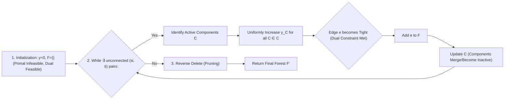

#  slides

## 1. Title Slide: Steiner Forest via Primal-Dual: The Classical 2-Approximation 🌳

**(Time: 2 minutes)**

**🎯 Key Takeaways:**
*   Steiner Forest is a fundamental network optimization problem.
*   We explore the influential 2-approximation primal-dual algorithm (PD-SF).

**Problem Definition: The Steiner Forest Problem**
We are given an undirected graph $G = (V, E)$ with non-negative edge weights $w_e \geq 0$ for all $e \in E$, and $k$ terminal pairs, $(s_i, t_i)$, where $s_i, t_i \in V$.

**Goal:** Find a minimum-cost subset of edges $F \subseteq E$ such that every pair $(s_i, t_i)$ is connected in the resulting subgraph $(V, F)$.

**Problem Complexity:**
*   The Steiner Forest problem is a generalization of the classic Steiner Tree Problem.
*   It is known to be **NP-hard** and **APX-hard**.

---

## 2. Background and the 2-Approximation Barrier 🚧

**(Time: 3 minutes)**

**The Primal-Dual Approach**
*   The primal-dual method is a standard tool in combinatorial optimization, often reducing weighted problems to easier, unweighted combinatorial problems.
*   In approximation algorithms, the method is modified by relaxing the complementary slackness conditions to find approximate integer solutions.
*   PD-SF is one of the earliest and most famous examples of the primal-dual technique applied to approximation algorithms.

**The Landmark Result (PD-SF)**
*   The PD-SF algorithm, due to Agrawal, Klein, and Ravi, established the first known constant-factor approximation for Steiner Forest.
*   This algorithm yields a **2-approximation ratio**.

**The Long-Standing Barrier**
*   Improving on the 2-approximation factor for Steiner Forest has been considered one of the most prominent open problems in approximation algorithms for decades.
*   **Recent Theoretical Update:** A novel deterministic algorithm has recently been proposed that claims to achieve a $2 - 10^{-11}$ approximation, potentially breaking this long-standing barrier.

---

## 3. Primal LP Formulation: The Cut Relaxation ✂️

**(Time: 4 minutes)**

The PD-SF algorithm is based on the **undirected cut relaxation (UCR)** for the Steiner Forest problem.

**Primal Cut-Based Formulation (IP)**
*   We assign a variable $x_e \in \{0, 1\}$ to each edge $e \in E$, indicating selection.
*   We define $S_i$ as the set of vertex subsets $S \subseteq V$ that separate terminals $s_i$ and $t_i$, i.e., $|S \cap \{s_i, t_i\}| = 1$.
*   The edges crossing a cut $(S, \bar{S})$ are denoted $\delta(S)$.

$$ \text{minimize } \sum_{e \in E} w_e x_e \tag{1} $$
$$ \text{subject to: } \sum_{e \in \delta(S)} x_e \geq 1, \quad \forall S \subseteq V : S \in S_i \text{ for some } i \tag{2} $$
$$ x_e \in \{0, 1\}, \quad \forall e \in E \tag{3} $$
*(Note: Constraint (2) guarantees that any cut separating a terminal pair must be crossed by at least one selected edge, thus ensuring connectivity for that pair).*

**LP Relaxation**
The linear program (LP) relaxation replaces the integrality constraint (3) with the non-negativity constraint:
$$ x_e \geq 0, \quad \forall e \in E $$
*(Note: The constraint $x_e \leq 1$ is redundant in this minimization context).*

---

## 4. Dual LP Formulation and the Moat Interpretation 🌊

**(Time: 4 minutes)**

The dual of the LP relaxation is formulated with variables $y_S$ corresponding to each cut constraint $S$.

$$ \text{maximize } \sum_{S \subseteq V} y_S \tag{4} $$
$$ \text{subject to: } \sum_{S: e \in \delta(S)} y_S \leq w_e, \quad \forall e \in E \tag{5} $$
$$ y_S \geq 0, \quad \exists i : S \in S_i \tag{6} $$

**Dual Variable Interpretation (Moats)**
*   Dual variable $y_S$ can be viewed as the width of a **moat** surrounding subset $S$.
*   The first constraint (5) ensures that the sum of the widths ($y_S$) of all moats an edge $e$ crosses cannot exceed the edge's cost $w_e$.

**Primal-Dual Schema Guiding Principle**
The core idea is to iteratively construct solutions such that they satisfy the **primal complementary slackness conditions**:
$$ x_e = 1 \quad \implies \quad \sum_{S: e \in \delta(S)} y_S = w_e $$
In other words, an edge is added to the solution $F$ only if the corresponding dual constraint is **tight** (or "critical").

---

## 5. The PD-SF Algorithm (Algorithm 1) 🛠️

**(Time: 5 minutes)**

The PD-SF algorithm constructs the primal solution $F'$ (the forest) and the dual solution $y$ simultaneously.

**Algorithm Flow**

**Key Steps and Mechanisms:**
1.  **Initialization:** Start with dual variables $y \leftarrow 0$ and solution $F \leftarrow \emptyset$.
2.  **Active Sets:** The dual variables $y_S$ are increased only for **active connected components** $C \in \mathcal{C}$. A component $C$ is active if it separates some terminal pair $(s_i, t_i)$.
3.  **Uniform Increase:** All active dual variables are raised **uniformly** and simultaneously until an edge $e$ becomes tight (the sum of moats it crosses equals its cost $w_e$).
4.  **Edge Selection:** The tight edge $e$ is added to $F$.
5.  **Pruning (Reverse Delete):** After all pairs are connected, redundant edges are removed from $F$ in the **reverse order of addition**. This step is crucial for the approximation proof.

---

## 6. PD-SF Mechanics and Practicality 💡

**(Time: 3 minutes)**

**Dual Ascent Intuition**
*   The algorithm builds the forest $F$ by gradually expanding "moats" around active connected components.
*   When a moat expansion makes an edge tight, that edge is added to the solution, connecting or merging components.
*   The dual increase is synchronized to ensure fairness and maximize the total dual value $\sum y_S$ relative to the final cost $c(F')$.

**Efficient Implementation Details**
*   To maintain components efficiently, the algorithm uses functions mapping each vertex to its label, status, and associated growth rate, allowing components to be found in constant time and merged in $O(n)$.
*   The reduced cost of edges is computed efficiently (in constant time per edge) using the endpoints' growth information.
*   The overall time complexity for the main loop of PD-SF is $O(mn)$.

**Experimental Superiority**
*   In extensive experimental studies on the SteinForestLib instances, the PD-SF algorithm proved to be the **fastest** among all algorithms considered (including greedy and randomized methods).
*   The running time of PD-SF is not highly dependent on the number of terminals ($k$), unlike greedy algorithms (PG-SF, GL-SF).
*   **Correlation Analysis:** PD-SF runtime has only a small positive correlation with the number of vertices ($n$, coefficient 0.34), and very small correlation with edges ($m$), terminals ($k$), and density ($d$).

---

## 7. The Proof Sketch: Why $\rho=2$ 📝

**(Time: 4 minutes)**

The 2-approximation theorem relies on showing that the final solution cost $c(F')$ is bounded by twice the total dual value $\sum y_S$, which serves as a lower bound for the optimal cost $c(F^*)$.

**1. Expressing Cost via Dual Variables**
By complimentary slackness (since all edges in $F'$ are tight at some point), the cost of the final forest $F'$ is:
$$ c(F') = \sum_{e \in F'} c(e) = \sum_{S} y_S |F' \cap \delta(S)| $$
The goal is to show:
$$ \sum_{S} y_S |F' \cap \delta(S)| \leq 2 \sum_{S} y_S \quad (\text{Claim 21.4.6}) $$

**2. The Key Lemma: Bounding Edge Crossings**
This inequality is proven incrementally via induction on each iteration $t$ of the algorithm. We require that the increase in the left side is at most twice the increase in the right side.

Let $A_t$ be the set of active components in iteration $t$, and $\Delta_t$ be the uniform increase amount. The core inequality needed is:
$$ \sum_{S \in A_t} |F' \cap \delta(S)| \leq 2 |A_t| \quad \text{(Lemma 2)} $$

**3. The Role of the Reverse Delete Step**
The reverse delete step (pruning) ensures that the graph induced by the final edges $F'$ on the components $A_t$ (denoted $F'[A_t]$ or $G_j$) **is a forest** (i.e., acyclic).
*   If $F'[A_t]$ contained a cycle, the last edge added ($e$) in that cycle would have created a redundant path between its endpoints, meaning $e$ would have been pruned, leading to a contradiction.

**4. The Forest Property Concludes the Proof**
Because $F'[A_t]$ is a forest, and the active components $A_t$ include all the leaves of that forest, the sum of the degrees of the nodes in $A_t$ is bounded:
$$ \sum_{S \in A_t} \text{Degree}_{F'[A_t]}(S) \leq 2 |A_t| $$
Since $\text{Degree}_{F'[A_t]}(S) = |F' \cap \delta(S)|$, the key lemma holds, establishing the 2-approximation ratio.

---

## 8. Experimental Validation and Practicality 📈

**(Time: 3 minutes)**

Experimental results confirm that PD-SF excels in practice, often providing **near-optimal solutions** significantly faster than competitors.

**Speed Comparison (Running Time)**
*   PD-SF is consistently the fastest among the 2-approximation PD-SF, two greedy algorithms (PG-SF, GL-SF), and the randomized TM-SF.
*   PD-SF is often **one to three orders of magnitude faster** than the next quickest algorithm (PG-SF) for sparse graphs.
*   For practical use, PD-SF requires a substantially smaller running time than solving the equivalent Integer Program using a solver like CPLEX.

**Quality Comparison (Actual Approximation Ratio)**

| Algorithm | Theoretical Ratio | Worst Observed Actual Ratio (Test Set B/C) | Observation |
| :---: | :---: | :---: | :--- |
| **PD-SF** | 2 | 1.269 | Very close to optimal. |
| **PG-SF** (Greedy) | $\Omega(\log n)$ | 1.115 | Performs surprisingly well, on par with PD-SF quality. |
| **GL-SF** (Gluttonous) | 96 | 1.127 | Also performs well in terms of solution quality. |
| **TM-SF** (Randomized) | $O(\log n)$ | 7.086 | Highest cost solutions, confirming theoretical expectation. |

*Citations for table data:*

**Conclusion on Performance:**
For practical purposes where speed and quality (close to optimal) are critical, PD-SF is highly recommended.

---

## 9. Conclusion and Future Directions 🔮

**(Time: 2 minutes)**

**Summary of PD-SF:**
*   PD-SF is a classical **2-approximation algorithm** for the Steiner Forest problem, utilizing a primal-dual framework based on the undirected cut relaxation.
*   The algorithm employs a **uniform dual variable increase** for active connected components, followed by a **reverse delete (pruning)** step crucial for ensuring the approximation guarantee.
*   In practice, PD-SF is the most efficient algorithm among those studied, consistently providing near-optimal results while being substantially faster than alternatives.

**The Enduring Challenge:**
*   The theoretical approximation factor of 2 remains a significant barrier for Steiner Forest.
*   Research continues into whether LP relaxations (such as the Bidirected Cut Relaxation (Forest-BCR)) might have an integrality gap strictly less than 2, despite the classical cut relaxation gap being known to be 2.
*   The pursuit of an approximation better than 2 highlights the deep complexity of this fundamental network design problem.
